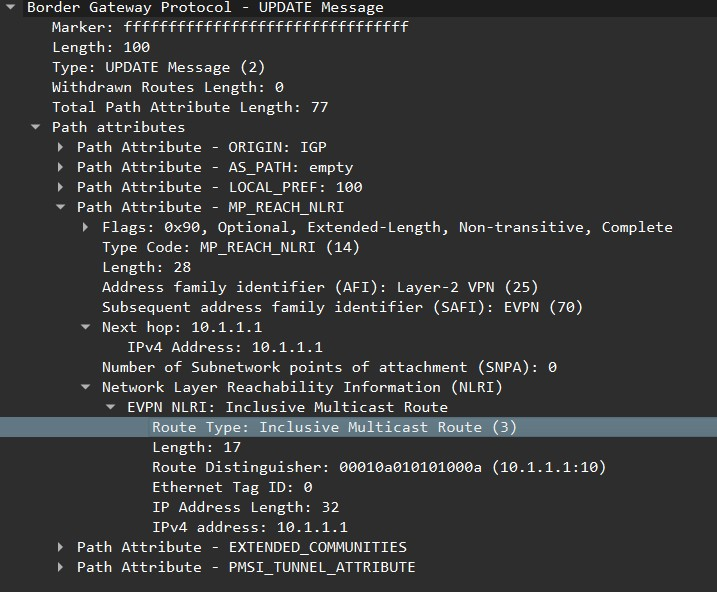
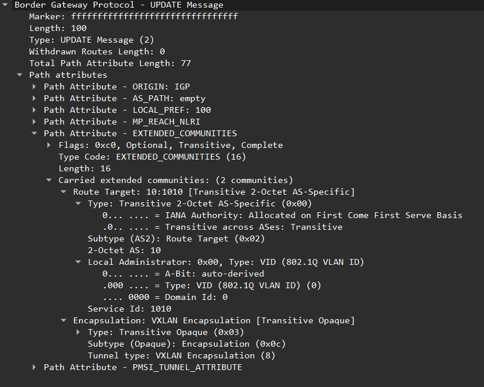
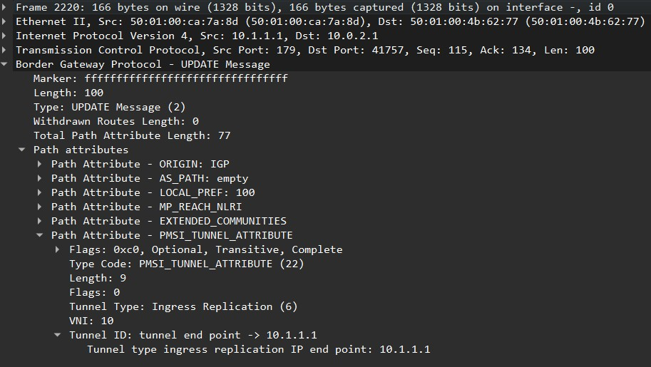
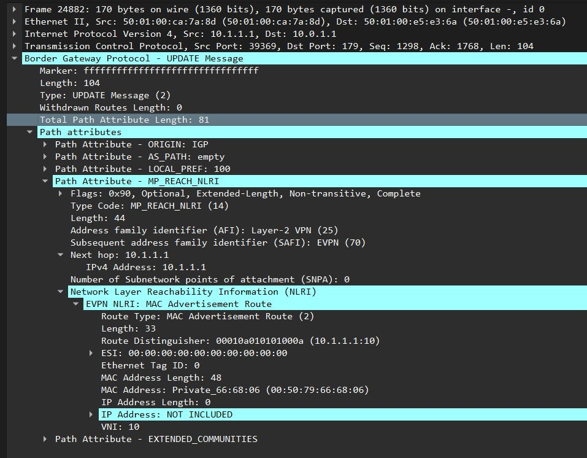
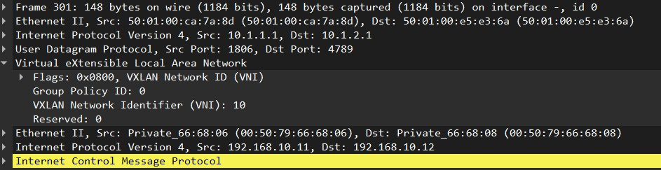

## VxLAN. EVPN L2 

### Цель работы:
 - Настроить Overlay на основе VxLAN EVPN для L2 связанности между клиентами.

 Для лабороторной работы в Underlay будем использовать OSPF, в Overlay iBGP.

### Схема стенда
Схему для VxLAN/EVPN L2 будем использовать без изменений, только добавим клиентов.


Для клиентов будем использовать следующие vlan и ip сети.

|Vlan| Network|
|----|----|
|vlan 10|192.168.10.0/24|
|vlan 20|192.158.20.0/24|

Таблица MAC и IP адресов АРМ.
|АРМ|Switch|MAC|IP|Port|
|---|-----|---|--|---|
|АМР10-1|Leaf.1|00:50:79:66:68:06|192.168.10.11|Eth5|
|АМР10-2|Leaf.2|00:50:79:66:68:08|192.168.10.12|Eth5|
|АМР10-3|Leaf.3|00:50:79:66:68:0a|192.168.10.13|Eth6|
|АМР20-1|Leaf.2|00:50:79:66:68:07|192.168.20.11|Eth6|
|АМР20-2|Leaf.3|00:50:79:66:68:09|192.168.20.12|Eth5|

### Underlay
Для Underlay OSPF будем использовать настройки из [Лабороторной 2](https://github.com/evsboroda/otus-design-dc/tree/main/Lab2)

### Overlay
В Overlay для Control-plane будем использовать EVPN (Ethernet VPN) который является стандартом [RFC 7432](https://datatracker.ietf.org/doc/html/rfc7432) и использует отдельную address family в Multi Protocol BGP. AFI 25 (l2vpn), SAFI 70 (evpn). Для этого в Overlay будем использовать iBGP.

EVPN позволяет передавать MAC-адрес так же, как и маршруты в анонсах BGP. EVPN использует 5ть типов маршрутов

> *Route Type-1* - Ethernet Auto-Discovery Route. Для объявления Ethernet Segment Identifier (ESI) (конвергенция, балансировка).

> *Route Type-2* - Host Advertisement Route. Для анонса информации о подключенных хостах.

> *Route Type-3* - Inclusive Multicast Ethernet Tag Route (IMET) Используется для автоматического обноружения VTEP и работы с BUM (Ingress Replication).

> *Route Type-4* - Ethernet Segment Route. Для выбора DF (кто управляет BUM)

> *Route Type-5* - IP-prefix route advertisement. Для анонса внешних маршрутов в фабрику.

Для настройки L2 связанности между клиентами с использованием EVPN будем использовать маршруты Type-2 и Type-3.

Для работы EVPN на всех коммутаторах включим multi-agent.
```
service routing protocols model multi-agent
```

### Настройки iBGP на Leaf
- Включим процесс BGP и зададим AS `#router bgp 65101`
- Укажем `router-id` будем использовать адрес нашего _loopback1_.
- Создадим `peer group LEAFS` и укажем нащих соседей. Соседство будем устанавливать на интерфейсе Loopback1.
- Включим `send-community extended` так как EVPN их использует для распространения маршрутной информации.
- Включим `address-family evpn` и активируем соседей.
- Выключим `address-family ipv4` так как её мы не используем.
```
router bgp 65001
   router-id 10.1.1.1
   neighbor SPINES peer group
   neighbor SPINES remote-as 65001
   neighbor SPINES update-source Loopback1
   neighbor SPINES send-community extended
   neighbor 10.0.1.1 peer group SPINES
   neighbor 10.0.1.1 description Spine.1
   neighbor 10.0.2.1 peer group SPINES
   neighbor 10.0.2.1 description Spine.2
   !
   address-family evpn
      neighbor SPINES activate
   address-family ipv4
      no neighbor SPINES activate
```
Настройки iBGP на Leaf будет отличаться только _router-id_, копируем конфигурацию iBGP на оставшихся Leaf.

### Настройки iBGP на Spine
- Включим процесс BGP и зададим AS `#router bgp 65101`
- Укажем `router-id` будем использовать адрес нашего _loopback1_.
- Создадим `peer group Leafs` и укажем нащих соседей. Соседство будем устанавливать на интерфейсе Loopback1.
- для распространения маршрутов включим `route-reflector-client`
- Включим `send-community extended` так как EVPN их использует для распространения маршрутной информации.
- Включим `address-family evpn` и активируем соседей.
- Выключим `address-family ipv4` так как её мы не используем.
```
router bgp 65001
   router-id 10.0.1.1
   neighbor LEAFS peer group
   neighbor LEAFS remote-as 65001
   neighbor LEAFS update-source Loopback1
   neighbor LEAFS route-reflector-client
   neighbor LEAFS send-community extended
   neighbor 10.1.1.1 peer group LEAFS
   neighbor 10.1.2.1 peer group LEAFS
   neighbor 10.1.3.1 peer group LEAFS
   !
   address-family evpn
      neighbor LEAFS activate
   !
   address-family ipv4
      no neighbor LEAFS activate
```
Настройки iBGP на Spine будет отличаться только _router-id_, копируем конфигурацию iBGP на оставшихся Spine. На этом настройки Spine закончены.

<details>
<summary>Проверим BGP соседтво нв Spine</summary>
<b>Spine.1</b>

```
Spine.1#show bgp summary 
BGP summary information for VRF default
Router identifier 10.0.1.1, local AS number 65001
Neighbor          AS Session State AFI/SAFI                AFI/SAFI State   NLRI Rcd   NLRI Acc
-------- ----------- ------------- ----------------------- -------------- ---------- ----------
10.1.1.1       65001 Established   L2VPN EVPN              Negotiated              1          1
10.1.2.1       65001 Established   L2VPN EVPN              Negotiated              2          2
10.1.3.1       65001 Established   L2VPN EVPN              Negotiated              0          0
```
<b>Spine.2</b>
```
Spine.2#show bgp summary 
BGP summary information for VRF default
Router identifier 10.0.2.1, local AS number 65001
Neighbor          AS Session State AFI/SAFI                AFI/SAFI State   NLRI Rcd   NLRI Acc
-------- ----------- ------------- ----------------------- -------------- ---------- ----------
10.1.1.1       65001 Established   L2VPN EVPN              Negotiated              1          1
10.1.2.1       65001 Established   L2VPN EVPN              Negotiated              2          2
10.1.3.1       65001 Established   L2VPN EVPN              Negotiated              0          0
```
</details>

Соседство BGP установилось.

### Настройки VXLAN Tunnel Endpoints (VTEP).
Настроим VTI интерфейс.
- Настроим интерфейс Vxlan1
- насроим интефейс который будет использоваться при обмене VXLAN кадрами.
- Порт для VxLan будем использовать по умолчанию.
```
interface Vxlan1
   vxlan source-interface Loopback1
   vxlan udp-port 4789
   ```
Проверим настройки VxLan командой `show interfaces vxlan 1`.
```
Leaf.1(config)#show interfaces vxlan 1
Vxlan1 is up, line protocol is up (connected)
  Hardware is Vxlan
  Source interface is Loopback1 and is active with 10.1.1.1
  Listening on UDP port 4789
  Replication/Flood Mode is headend with Flood List Source: EVPN
  Remote MAC learning via EVPN
  VNI mapping to VLANs
  Static VLAN to VNI mapping is not configured
  Static VRF to VNI mapping is not configured
  Shared Router MAC is 0000.0000.0000
```
Видим что для репликации BUM трафика и изучения MAC адресов изсползуем EVPN.

Копируем настройки vxlan интерфейса на оставшиеся Leaf.

> Настроем _vlan'ы_ на _Leaf'ах_, сами настройки пропустим.

Далее на _Leaf_ в интерфейсе _vxlan_ примапим их к _vni_.

Будем использовать VLAN-Based модель маппинга EVI к L2-домену, где vlan маппится к vni. Для vlan 10  `vxlan vlan 10 vni 10`

**Настройка Leaf.1.**

```
interface Vxlan1
   vxlan vlan 10 vni 10
```
В процессе BGP настроем MAC-VRF для vlan
-  RD (Route Distinguisher) - Делает уникальными маршруты в пределах разных VRF. Будем использовать автоматическую настройку, будет иметь формат LoopbackIP:VID. 
- route-target - используем для политик импорта и экспорта маршрутов между VRF. Назначаем вручную.
- redistribute learned - Включаем что бы все локально изученные MAC-адреса в VLAN автоматически объявлялись как маршруты Route-type 2.
```
router bgp 65001
   vlan 10
      rd auto
      route-target both 10:1010
      redistribute learned
```

При включении _vlan_, vtep отправляет bgp update с route-type 3 и если ещё есть коммутаторы с таким же _vlan_ до он добавляет их к себе в таблицу.

**Attribute MP_REACH_NLRI**



**Attribute EXTENDED_COMMUNITIES**



**Attribute PMSI_TUNNEL_ATTRIBUTE**



Итоговая конфигурция VxLan/EVPN на _Leaf.1_:
```
interface Vxlan1
   vxlan source-interface Loopback1
   vxlan udp-port 4789
   vxlan vlan 10 vni 10
!
router bgp 65001
   router-id 10.1.1.1
   neighbor SPINES peer group
   neighbor SPINES remote-as 65001
   neighbor SPINES update-source Loopback1
   neighbor SPINES send-community extended
   neighbor 10.0.1.1 peer group SPINES
   neighbor 10.0.1.1 description Spine.1
   neighbor 10.0.2.1 peer group SPINES
   neighbor 10.0.2.1 description Spine.2
   !
   vlan 10
      rd auto
      route-target both 10:1010
      redistribute learned
   !
   address-family evpn
      neighbor SPINES activate
   !
   address-family ipv4
      no neighbor SPINES activate
```

Проверим маршруты в BGP EVP Route-type 3.
```
Leaf.1(config-vlan-10)#show bgp evpn route-type imet
BGP routing table information for VRF default
Router identifier 10.1.1.1, local AS number 65001
Route status codes: * - valid, > - active, S - Stale, E - ECMP head, e - ECMP
                    c - Contributing to ECMP, % - Pending BGP convergence
Origin codes: i - IGP, e - EGP, ? - incomplete
AS Path Attributes: Or-ID - Originator ID, C-LST - Cluster List, LL Nexthop - Link Local Nexthop

          Network                Next Hop              Metric  LocPref Weight  Path
 * >      RD: 10.1.1.1:10 imet 10.1.1.1
                                 -                     -       -       0       i
 * >Ec    RD: 10.1.2.1:10 imet 10.1.2.1
                                 10.1.2.1              -       100     0       i Or-ID: 10.1.2.1 C-LST: 10.0.2.1 
 *  ec    RD: 10.1.2.1:10 imet 10.1.2.1
                                 10.1.2.1              -       100     0       i Or-ID: 10.1.2.1 C-LST: 10.0.1.1 
 * >Ec    RD: 10.1.2.1:20 imet 10.1.2.1
                                 10.1.2.1              -       100     0       i Or-ID: 10.1.2.1 C-LST: 10.0.2.1 
 *  ec    RD: 10.1.2.1:20 imet 10.1.2.1
                                 10.1.2.1              -       100     0       i Or-ID: 10.1.2.1 C-LST: 10.0.1.1 
 * >Ec    RD: 10.1.3.1:10 imet 10.1.3.1
                                 10.1.3.1              -       100     0       i Or-ID: 10.1.3.1 C-LST: 10.0.2.1 
 *  ec    RD: 10.1.3.1:10 imet 10.1.3.1
                                 10.1.3.1              -       100     0       i Or-ID: 10.1.3.1 C-LST: 10.0.1.1 
 * >Ec    RD: 10.1.3.1:20 imet 10.1.3.1
                                 10.1.3.1              -       100     0       i Or-ID: 10.1.3.1 C-LST: 10.0.1.1 
 *  ec    RD: 10.1.3.1:20 imet 10.1.3.1
                                 10.1.3.1              -       100     0       i Or-ID: 10.1.3.1 C-LST: 10.0.2.1 
```
<details>
<summary>Попробуем запустить ping с АРМ10-1 до АРМ10-2.</summary>

```
 ARM10-1> ping 192.168.10.12

84 bytes from 192.168.10.12 icmp_seq=1 ttl=64 time=163.636 ms
84 bytes from 192.168.10.12 icmp_seq=2 ttl=64 time=42.818 ms
84 bytes from 192.168.10.12 icmp_seq=3 ttl=64 time=70.612 ms
84 bytes from 192.168.10.12 icmp_seq=4 ttl=64 time=45.677 ms
84 bytes from 192.168.10.12 icmp_seq=5 ttl=64 time=47.441 ms
```
</details>

VxLan работает и ping проходит.

Посмотрим MAC таблицу.

```
Leaf.1#
Leaf.1#show mac address-table 
          Mac Address Table
------------------------------------------------------------------

Vlan    Mac Address       Type        Ports      Moves   Last Move
----    -----------       ----        -----      -----   ---------
  10    0050.7966.6806    DYNAMIC     Et5        1       0:02:09 ago
  10    0050.7966.6808    DYNAMIC     Vx1        1       0:02:08 ago
Total Mac Addresses for this criterion: 2
```
В таблице MAC видим _АРМ10-1_ который находится `0050.7966.6806` за портом `eth5` и MAC адрес _АРМ10-2_ `0050.7966.6808` который находится за портом _vxlan1_.

Проверим маршруты BGP EVPN _Route-type 2_ и посмотрим DUMP трафика. 
```
Leaf.1#show bgp evpn route-type mac-ip
BGP routing table information for VRF default
Router identifier 10.1.1.1, local AS number 65001
Route status codes: * - valid, > - active, S - Stale, E - ECMP head, e - ECMP
                    c - Contributing to ECMP, % - Pending BGP convergence
Origin codes: i - IGP, e - EGP, ? - incomplete
AS Path Attributes: Or-ID - Originator ID, C-LST - Cluster List, LL Nexthop - Link Local Nexthop

          Network                Next Hop              Metric  LocPref Weight  Path
 * >      RD: 10.1.1.1:10 mac-ip 0050.7966.6806
                                 -                     -       -       0       i
 * >Ec    RD: 10.1.2.1:10 mac-ip 0050.7966.6808
                                 10.1.2.1              -       100     0       i Or-ID: 10.1.2.1 C-LST: 10.0.2.1 
 *  ec    RD: 10.1.2.1:10 mac-ip 0050.7966.6808
                                 10.1.2.1              -       100     0       i Or-ID: 10.1.2.1 C-LST: 10.0.1.1 
```
Появился маршрут до АРМ10-2 через _Loopback1 Leaf2_ 
При изучении Коммутатором MAC адреса клиента он сразу отправляет BGP update c Route-type 2.


<details>
<summary>Проверим доступность клиентов в <b>vlan10</b> c <b>АРМ10-1</b> на <b>Leaf.1</b>. <b>vlan20</b> в этой лабороторной работе нас не интересует, его проверять не будем.</summary>

**АРМ10-1**
```
ARM10-1> ping 192.168.10.12

84 bytes from 192.168.10.12 icmp_seq=1 ttl=64 time=132.603 ms
84 bytes from 192.168.10.12 icmp_seq=2 ttl=64 time=88.400 ms
84 bytes from 192.168.10.12 icmp_seq=3 ttl=64 time=51.882 ms
84 bytes from 192.168.10.12 icmp_seq=4 ttl=64 time=44.767 ms
84 bytes from 192.168.10.12 icmp_seq=5 ttl=64 time=50.818 ms

ARM10-1> ping 192.168.10.13

84 bytes from 192.168.10.13 icmp_seq=1 ttl=64 time=54.937 ms
84 bytes from 192.168.10.13 icmp_seq=2 ttl=64 time=87.489 ms
84 bytes from 192.168.10.13 icmp_seq=3 ttl=64 time=48.040 ms
84 bytes from 192.168.10.13 icmp_seq=4 ttl=64 time=114.598 ms
84 bytes from 192.168.10.13 icmp_seq=5 ttl=64 time=50.064 ms
```
Все клиенты доступны и отвечают.
</details>

<details>
<summary>Проверим итоговую таблицу <b>BGP EVP</b> и таблицу <b>MAC</b> для VxLan.</summary>

```
Leaf.1#show bgp evpn 
BGP routing table information for VRF default
Router identifier 10.1.1.1, local AS number 65001
Route status codes: * - valid, > - active, S - Stale, E - ECMP head, e - ECMP
                    c - Contributing to ECMP, % - Pending BGP convergence
Origin codes: i - IGP, e - EGP, ? - incomplete
AS Path Attributes: Or-ID - Originator ID, C-LST - Cluster List, LL Nexthop - Link Local Nexthop

          Network                Next Hop              Metric  LocPref Weight  Path
 * >      RD: 10.1.1.1:10 mac-ip 0050.7966.6806
                                 -                     -       -       0       i
 * >Ec    RD: 10.1.2.1:10 mac-ip 0050.7966.6808
                                 10.1.2.1              -       100     0       i Or-ID: 10.1.2.1 C-LST: 10.0.1.1 
 *  ec    RD: 10.1.2.1:10 mac-ip 0050.7966.6808
                                 10.1.2.1              -       100     0       i Or-ID: 10.1.2.1 C-LST: 10.0.2.1 
 * >Ec    RD: 10.1.3.1:10 mac-ip 0050.7966.680a
                                 10.1.3.1              -       100     0       i Or-ID: 10.1.3.1 C-LST: 10.0.2.1 
 *  ec    RD: 10.1.3.1:10 mac-ip 0050.7966.680a
                                 10.1.3.1              -       100     0       i Or-ID: 10.1.3.1 C-LST: 10.0.1.1 
 * >      RD: 10.1.1.1:10 imet 10.1.1.1
                                 -                     -       -       0       i
 * >Ec    RD: 10.1.2.1:10 imet 10.1.2.1
                                 10.1.2.1              -       100     0       i Or-ID: 10.1.2.1 C-LST: 10.0.2.1 
 *  ec    RD: 10.1.2.1:10 imet 10.1.2.1
                                 10.1.2.1              -       100     0       i Or-ID: 10.1.2.1 C-LST: 10.0.1.1 
 * >Ec    RD: 10.1.2.1:20 imet 10.1.2.1
                                 10.1.2.1              -       100     0       i Or-ID: 10.1.2.1 C-LST: 10.0.2.1 
 *  ec    RD: 10.1.2.1:20 imet 10.1.2.1
                                 10.1.2.1              -       100     0       i Or-ID: 10.1.2.1 C-LST: 10.0.1.1 
 * >Ec    RD: 10.1.3.1:10 imet 10.1.3.1
                                 10.1.3.1              -       100     0       i Or-ID: 10.1.3.1 C-LST: 10.0.2.1 
 *  ec    RD: 10.1.3.1:10 imet 10.1.3.1
                                 10.1.3.1              -       100     0       i Or-ID: 10.1.3.1 C-LST: 10.0.1.1 
 * >Ec    RD: 10.1.3.1:20 imet 10.1.3.1
                                 10.1.3.1              -       100     0       i Or-ID: 10.1.3.1 C-LST: 10.0.2.1 
 *  ec    RD: 10.1.3.1:20 imet 10.1.3.1
                                 10.1.3.1              -       100     0       i Or-ID: 10.1.3.1 C-LST: 10.0.1.1 
```
Видим маршруты Type 2 и 3 до всех VTEP через оба Spine.

```
Leaf.1#show vxlan address-table
          Vxlan Mac Address Table
----------------------------------------------------------------------

VLAN  Mac Address     Type      Prt  VTEP             Moves   Last Move
----  -----------     ----      ---  ----             -----   ---------
  10  0050.7966.6808  EVPN      Vx1  10.1.2.1         1       0:00:14 ago
  10  0050.7966.680a  EVPN      Vx1  10.1.3.1         1       0:00:07 ago
Total Remote Mac Addresses for this criterion: 2
```
</details>

<details>
<summary>Проверим интерфейс VxLan 1</summary>

```
Leaf.1#show interfaces vxlan 1
Vxlan1 is up, line protocol is up (connected)
  Hardware is Vxlan
  Source interface is Loopback1 and is active with 10.1.1.1
  Listening on UDP port 4789
  Replication/Flood Mode is headend with Flood List Source: EVPN
  Remote MAC learning via EVPN
  VNI mapping to VLANs
  Static VLAN to VNI mapping is 
    [10, 10]         
  Note: All Dynamic VLANs used by VCS are internal VLANs.
        Use 'show vxlan vni' for details.
  Static VRF to VNI mapping is not configured
  Headend replication flood vtep list is:
    10 10.1.2.1        10.1.3.1       
  Shared Router MAC is 0000.0000.0000
```
Видим что мы используем модель <b>VLAN-Based</b> где мы мапим <b>vlan 10</b> в <b>vni 10</b>. Также видим, что наш <b>vtep</b> подписан на <b>Leaf.2</b> и <b>Leaf.3</b> для <b>BUM</b> трафика в <b>vlan 10</b>.
</details>

<details>
<summary>Посмотрим инкапсуляцию в <b>VxLan</b></summary>



</details>

Итог: Настроили L2 связанности между клиентами с использованием EVPN.


