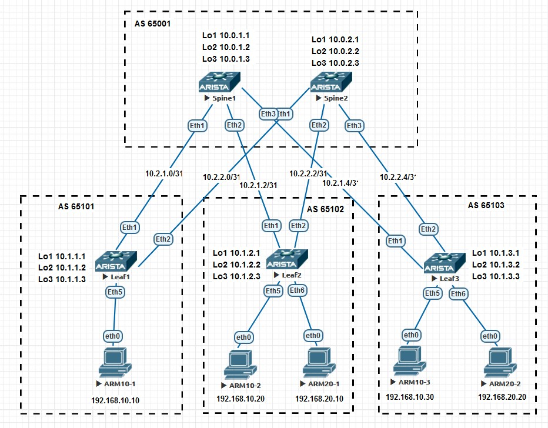
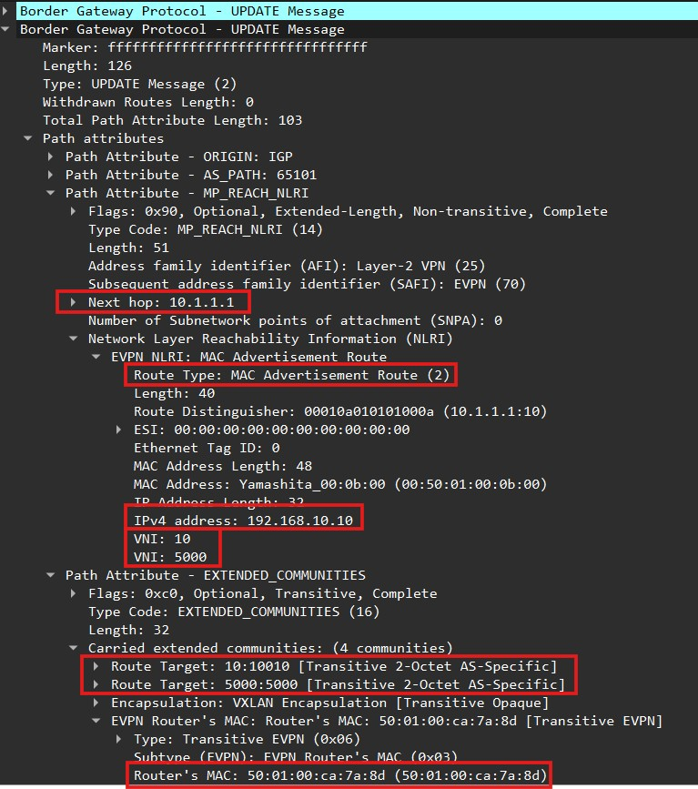
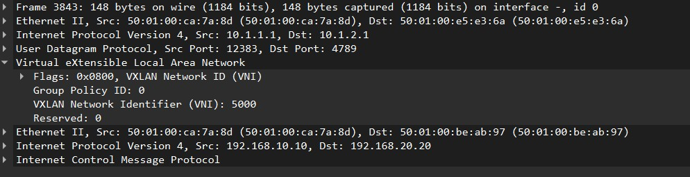

## VxLAN. L3VNI 

### Цель работы:
 - Настроить маршрутизацию в рамках Overlay между клиентами

В лабороторной работе для Underlay и Overlay будем использовать eBGP. Underlay настроим на IPv6 link-local адресах для p2p интерфейсов. Будем анонсировать IPv4 префиксы с использованием IPv6-некстхопов. В Overlay уже будем использовать IPv4 Loopback интерфейсы для построения VxLAN.

### Схема стенда
Схему для VxLAN/EVPN L3VNI будем использовать из [Лабороторной 4](https://github.com/evsboroda/otus-design-dc/tree/main/Lab4_BGP) для eBGP, только добавим клиентов.



Автономные системы будем использовать 2х байтные. 
Для Spine будем использовать общую AS, для Leaf'ов разные.

|Switch| AS |
|----|----|
|Spines|65001|
|Leaf.1|65101|
|Leaf.2|65102|
|Leaf.3|65103|

Для клиентов будем использовать следующие vlan и ip сети.

|Vlan| Network|
|----|----|
|vlan 10|192.168.10.0/24|
|vlan 20|192.158.20.0/24|

Таблица MAC и IP адресов АРМ.
|АРМ|Switch|MAC|IP|Port|
|---|-----|---|--|---|
|АМР10-1|Leaf.1|00:50:01:00:0b:00|192.168.10.10|Eth5|
|АМР10-2|Leaf.2|00:50:79:66:68:07|192.168.10.20|Eth5|
|АМР10-3|Leaf.3|00:50:79:66:68:08|192.168.10.30|Eth5|
|АМР20-1|Leaf.2|00:50:79:66:68:09|192.168.20.10|Eth6|
|АМР20-2|Leaf.3|00:50:01:00:06:00|192.168.20.20|Eth6|

### Underlay
Для Underlay eBGP будем использовать настройки из [Лабороторной 4](https://github.com/evsboroda/otus-design-dc/tree/main/Lab4_BGP). AS и настройки BGP возьмём из части по eBGP, а настройку интерфейсов и части по iBGP. 

### Overlay
Для общения клиентов в различных VLAN мы используем маршрутизацию, в VXLAN/EVPN функциональность маршрутизации называется IRB (Integrated Routing and Bridging) [RFC 9135](https://datatracker.ietf.org/doc/html/rfc9135) 

В IRB существует две модели:
 - Asymmetric IRB. Маршрутизация происходит на ingress VTEP, На egress VTEP только коммутация. На всех VTEP должны быть сконфигурированы все VLAN-VNI.
 - Symmetric IRB. Маршрутизация происходит на ingress VTEP и на egress VTEP. VLAN-VNI не должны быть одинаковы на всех VTEP фабрики, вместо этого выбирается один L3VNI через который и будет осуществляться маршрутизация.
 
 Что бы не настраивать на всех Leaf все vlan и vni, мы будем исользовать модель Symmetric IRB, где надо будет только настроить L3VNI.
 
На Leaf настроим _Anycast gateway_, это значит, что на всех _VTEP_ для каждого svi мы настроим одинаковые IP адреса и единый MAC адрес для всех SVI `ip virtual-router mac-address 00:00:00:00:00:10`, для того что бы если конечный узел мигрирует за другой _VTEP_ ему не пришлось обновлять _ARP_ запись. Она будет одинакова на любом _VTEP_.

#### Приступим к настройкам L3VNI.
- Настроим _VRF_ для клиентов и включим для него маршрутизацию.
```
vrf instance VRF1
ip routing vrf VRF1
```
- Включим _vlan_ в _vrf_ и настроем ему ip адрес который будет служит шлюзом для клиентов. На всех _Leaf_ для конкретного _vlan_ указывается одинаковый адрес.
- по *Best practice* из документаций ставим максимальное _mtu_
```
interface Vlan10
   mtu 9214
   vrf VRF1
   ip address virtual 192.168.10.1/24
```
 - в настройках _vxlan_ интерфейса назначим `vni 5000` для _VRF1_, тем самы сделаем его _L3VNI_
```
interface Vxlan1
   vxlan vrf VRF1 vni 5000
```
- Настроим IP-VRF и назнечим RD и RT. RT должны совпадать для импорта и экспорта.
- Для борьбы с "молчаливыми клиентами" будем использовать _Route-type 5_. Включим дистрибьюцию _connected_ сетей в данном _VRF_ `redistribute connected`
> Для инсталяции маршрута в таблицу маршрутизации конкретного *VRF*, VTEP должен знать куда слать трафик, до этого мы получали маршруты только /32 *Route Type-2* (MAC/IP >Advertisement route), которые разлетаются по EVPN только при появлении *MAC* адреса подключённого клиента к *VTEP*. Если клиент молчит, значит у нас нет маршрута. Что бы обойти данное ограничение в _EVPN_ есть _Route-type 5_, которые позволяют анонсировать IP префиксы. Следовательно мы сможем аннонсировать префикс _connected_ сети.
```
router bgp 65101
   router-id 10.1.1.1
     vrf VRF1
      rd 10.1.1.1:5000
      route-target import evpn 5000:5000
      route-target export evpn 5000:5000
      redistribute connected
```
- Настроим _Anycast gateway_.
```
ip virtual-router mac-address 00:00:00:00:00:10
```
### Итоговая конфигурция L3VNI на _Leaf.1_:
```
vrf instance VRF1
ip routing vrf VRF1
!
interface Vlan10
   mtu 9214
   vrf VRF1
   ip address virtual 192.168.10.1/24
!
interface Vxlan1
   vxlan vrf VRF1 vni 5000
!
router bgp 65101
   router-id 10.1.1.1
     vrf VRF1
      rd 10.1.1.1:5000
      route-target import evpn 5000:5000
      route-target export evpn 5000:5000
      redistribute connected
!
ip virtual-router mac-address 00:00:00:00:00:10
```

Скопируем настройки на остальные *Leaf*, отличаться будут только настройкой `interface Vlan`.

### Проверки

На _Spine_ проверим, что **BGP** соседство со всеми _Leaf_ установилось.
```
Spine.1#show bgp summary 
BGP summary information for VRF default
Router identifier 10.0.1.1, local AS number 65001
Neighbor                             AS Session State AFI/SAFI                AFI/SAFI State   NLRI Rcd   NLRI Acc
--------------------------- ----------- ------------- ----------------------- -------------- ---------- ----------
fe80::5201:ff:fe27:391%Et3        65103 Established   IPv4 Unicast            Negotiated              3          3
fe80::5201:ff:fe27:391%Et3        65103 Established   L2VPN EVPN              Negotiated              6          6
fe80::5201:ff:febe:ab97%Et2       65102 Established   IPv4 Unicast            Negotiated              3          3
fe80::5201:ff:febe:ab97%Et2       65102 Established   L2VPN EVPN              Negotiated              6          6
fe80::5201:ff:feca:7a8d%Et1       65101 Established   IPv4 Unicast            Negotiated              3          3
fe80::5201:ff:feca:7a8d%Et1       65101 Established   L2VPN EVPN              Negotiated              4          4
```
```
Spine.2#show bgp summary 
BGP summary information for VRF default
Router identifier 10.0.2.1, local AS number 65001
Neighbor                             AS Session State AFI/SAFI                AFI/SAFI State   NLRI Rcd   NLRI Acc
--------------------------- ----------- ------------- ----------------------- -------------- ---------- ----------
fe80::5201:ff:fe27:391%Et3        65103 Established   IPv4 Unicast            Negotiated              3          3
fe80::5201:ff:fe27:391%Et3        65103 Established   L2VPN EVPN              Negotiated              6          6
fe80::5201:ff:febe:ab97%Et2       65102 Established   IPv4 Unicast            Negotiated              3          3
fe80::5201:ff:febe:ab97%Et2       65102 Established   L2VPN EVPN              Negotiated              4          4
fe80::5201:ff:feca:7a8d%Et1       65101 Established   IPv4 Unicast            Negotiated              3          3
fe80::5201:ff:feca:7a8d%Et1       65101 Established   L2VPN EVPN              Negotiated              4          4
```
 
 Проверим настройки VxLan командой `show interfaces vxlan 1`.
 ```
 Leaf.1#show interfaces vxlan 1 
Vxlan1 is up, line protocol is up (connected)
  Hardware is Vxlan
  Source interface is Loopback1 and is active with 10.1.1.1
  Listening on UDP port 4789
  Replication/Flood Mode is headend with Flood List Source: EVPN
  Remote MAC learning via EVPN
  VNI mapping to VLANs
  Static VLAN to VNI mapping is 
    [10, 10]         
  Dynamic VLAN to VNI mapping for 'evpn' is
    [4094, 5000]     
  Note: All Dynamic VLANs used by VCS are internal VLANs.
        Use 'show vxlan vni' for details.
  Static VRF to VNI mapping is 
   [VRF1, 5000]
  Headend replication flood vtep list is:
    10 10.1.2.1        10.1.3.1       
  Shared Router MAC is 0000.0000.0000
```
Видим что наш _L3VNI_ приммаплин к *VRF1*.

Следующим шагом проверим маршруты в *EVPN* на *Leaf.1*
```
Leaf.1#show bgp evpn 
BGP routing table information for VRF default
Router identifier 10.1.1.1, local AS number 65101
Route status codes: * - valid, > - active, S - Stale, E - ECMP head, e - ECMP
                    c - Contributing to ECMP, % - Pending BGP convergence
Origin codes: i - IGP, e - EGP, ? - incomplete
AS Path Attributes: Or-ID - Originator ID, C-LST - Cluster List, LL Nexthop - Link Local Nexthop

          Network                Next Hop              Metric  LocPref Weight  Path
 * >      RD: 10.1.1.1:10 imet 10.1.1.1
                                 -                     -       -       0       i
 * >Ec    RD: 10.1.2.1:10 imet 10.1.2.1
                                 10.1.2.1              -       100     0       65001 65102 i
 *  ec    RD: 10.1.2.1:10 imet 10.1.2.1
                                 10.1.2.1              -       100     0       65001 65102 i
 * >Ec    RD: 10.1.2.1:20 imet 10.1.2.1
                                 10.1.2.1              -       100     0       65001 65102 i
 *  ec    RD: 10.1.2.1:20 imet 10.1.2.1
                                 10.1.2.1              -       100     0       65001 65102 i
 * >Ec    RD: 10.1.3.1:10 imet 10.1.3.1
                                 10.1.3.1              -       100     0       65001 65103 i
 *  ec    RD: 10.1.3.1:10 imet 10.1.3.1
                                 10.1.3.1              -       100     0       65001 65103 i
 * >Ec    RD: 10.1.3.1:20 imet 10.1.3.1
                                 10.1.3.1              -       100     0       65001 65103 i
 *  ec    RD: 10.1.3.1:20 imet 10.1.3.1
                                 10.1.3.1              -       100     0       65001 65103 i
 * >      RD: 10.1.1.1:5000 ip-prefix 192.168.10.0/24
                                 -                     -       -       0       i
 * >Ec    RD: 10.1.2.1:5000 ip-prefix 192.168.10.0/24
                                 10.1.2.1              -       100     0       65001 65102 i
 *  ec    RD: 10.1.2.1:5000 ip-prefix 192.168.10.0/24
                                 10.1.2.1              -       100     0       65001 65102 i
 * >Ec    RD: 10.1.3.1:5000 ip-prefix 192.168.10.0/24
                                 10.1.3.1              -       100     0       65001 65103 i
 *  ec    RD: 10.1.3.1:5000 ip-prefix 192.168.10.0/24
                                 10.1.3.1              -       100     0       65001 65103 i
 * >Ec    RD: 10.1.2.1:5000 ip-prefix 192.168.20.0/24
                                 10.1.2.1              -       100     0       65001 65102 i
 *  ec    RD: 10.1.2.1:5000 ip-prefix 192.168.20.0/24
                                 10.1.2.1              -       100     0       65001 65102 i
 * >Ec    RD: 10.1.3.1:5000 ip-prefix 192.168.20.0/24
                                 10.1.3.1              -       100     0       65001 65103 i
 *  ec    RD: 10.1.3.1:5000 ip-prefix 192.168.20.0/24
                                 10.1.3.1              -       100     0       65001 65103 i

```
Видим что у нас есть только маршруты _Route-type 3_  до каждого _VTEP_ и _Route-type 5_ с префиксами _SVI_. Маршрутов _Route-type 2_ нет. Все наши клиенты молчат.

Попробуем запустить пинг от АРМ10-1 до АРМ20-2
```
root@ARM10-1:~# ping 192.168.20.20
PING 192.168.20.20 (192.168.20.20) 56(84) bytes of data.
64 bytes from 192.168.20.20: icmp_seq=1 ttl=63 time=1405 ms
64 bytes from 192.168.20.20: icmp_seq=2 ttl=63 time=394 ms
64 bytes from 192.168.20.20: icmp_seq=3 ttl=62 time=97.0 ms
64 bytes from 192.168.20.20: icmp_seq=4 ttl=62 time=105 ms
64 bytes from 192.168.20.20: icmp_seq=5 ttl=62 time=94.1 ms
^C
--- 192.168.20.20 ping statistics ---
5 packets transmitted, 5 received, 0% packet loss, time 4024ms
rtt min/avg/max/mdev = 94.102/419.070/1404.844/506.037 ms, pipe 2
```
Пинг прощёл успешно, маршрутизация между _VNI_ есть.

Проверим ещё раз таблицу маршрутизации для маршрутов _Route-type 2_
```
Leaf.1#show bgp evpn route-type mac-ip 
BGP routing table information for VRF default
Router identifier 10.1.1.1, local AS number 65101
Route status codes: * - valid, > - active, S - Stale, E - ECMP head, e - ECMP
                    c - Contributing to ECMP, % - Pending BGP convergence
Origin codes: i - IGP, e - EGP, ? - incomplete
AS Path Attributes: Or-ID - Originator ID, C-LST - Cluster List, LL Nexthop - Link Local Nexthop

          Network                Next Hop              Metric  LocPref Weight  Path
 * >Ec    RD: 10.1.3.1:20 mac-ip 0050.0100.0600
                                 10.1.3.1              -       100     0       65001 65103 i
 *  ec    RD: 10.1.3.1:20 mac-ip 0050.0100.0600
                                 10.1.3.1              -       100     0       65001 65103 i
 * >Ec    RD: 10.1.3.1:20 mac-ip 0050.0100.0600 192.168.20.20
                                 10.1.3.1              -       100     0       65001 65103 i
 *  ec    RD: 10.1.3.1:20 mac-ip 0050.0100.0600 192.168.20.20
                                 10.1.3.1              -       100     0       65001 65103 i
 * >      RD: 10.1.1.1:10 mac-ip 0050.0100.0b00
                                 -                     -       -       0       i
 * >      RD: 10.1.1.1:10 mac-ip 0050.0100.0b00 192.168.10.10
                                 -                     -       -       0       i
```
У нас появились маршруты _MAC-VRF_ и _MAC/IP-VRF_ **/32**.

Посмотрим *DUMP* **BGP UPDATE** _Leaf.1_


_Leaf.1_ анонсировал _Route-type 2_. Появился IP адрес клиента и второй _VNI 5000_. Так же появился второй RT для _L3VNI_. Ещё появилось дополнительлное _extended communitie_ **routers's mac** в котором записан MAC _SVI_ интерфейса. VTEP его использует как Destenation MAC address.

<details>
<summary>Посмотрим детальный вывод маршрутов _EVPN_ на _Leaf.1_ после пинга.</summary>

```
Leaf.1#show bgp evpn route-type mac-ip detail 
BGP routing table information for VRF default
Router identifier 10.1.1.1, local AS number 65101
BGP routing table entry for mac-ip 0050.0100.0b00, Route Distinguisher: 10.1.1.1:10
 Paths: 1 available
  Local
    - from - (0.0.0.0)
      Origin IGP, metric -, localpref -, weight 0, tag 0, valid, local, best
      Extended Community: Route-Target-AS:10:10010 TunnelEncap:tunnelTypeVxlan
      VNI: 10 ESI: 0000:0000:0000:0000:0000
BGP routing table entry for mac-ip 0050.0100.0b00 192.168.10.10, Route Distinguisher: 10.1.1.1:10
 Paths: 1 available
  Local
    - from - (0.0.0.0)
      Origin IGP, metric -, localpref -, weight 0, tag 0, valid, local, best
      Extended Community: Route-Target-AS:10:10010 Route-Target-AS:5000:5000 TunnelEncap:tunnelTypeVxlan
      VNI: 10 L3 VNI: 5000 ESI: 0000:0000:0000:0000:0000
BGP routing table entry for mac-ip 0050.7966.6809, Route Distinguisher: 10.1.2.1:20
 Paths: 2 available
  65001 65102
    10.1.2.1 from fe80::5201:ff:fe4b:6277%Et2 (10.0.2.1)
      Origin IGP, metric -, localpref 100, weight 0, tag 0, valid, external, ECMP head, ECMP, best, ECMP contributor
      Extended Community: Route-Target-AS:20:10020 TunnelEncap:tunnelTypeVxlan
      VNI: 20 ESI: 0000:0000:0000:0000:0000
  65001 65102
    10.1.2.1 from fe80::5201:ff:fee5:e36a%Et1 (10.0.1.1)
      Origin IGP, metric -, localpref 100, weight 0, tag 0, valid, external, ECMP, ECMP contributor
      Extended Community: Route-Target-AS:20:10020 TunnelEncap:tunnelTypeVxlan
      VNI: 20 ESI: 0000:0000:0000:0000:0000
BGP routing table entry for mac-ip 0050.7966.6809 192.168.20.10, Route Distinguisher: 10.1.2.1:20
 Paths: 2 available
  65001 65102
    10.1.2.1 from fe80::5201:ff:fe4b:6277%Et2 (10.0.2.1)
      Origin IGP, metric -, localpref 100, weight 0, tag 0, valid, external, ECMP head, ECMP, best, ECMP contributor
      Extended Community: Route-Target-AS:20:10020 Route-Target-AS:5000:5000 TunnelEncap:tunnelTypeVxlan EvpnRouterMac:50:01:00:be:ab:97
      VNI: 20 L3 VNI: 5000 ESI: 0000:0000:0000:0000:0000
  65001 65102
    10.1.2.1 from fe80::5201:ff:fee5:e36a%Et1 (10.0.1.1)
      Origin IGP, metric -, localpref 100, weight 0, tag 0, valid, external, ECMP, ECMP contributor
      Extended Community: Route-Target-AS:20:10020 Route-Target-AS:5000:5000 TunnelEncap:tunnelTypeVxlan EvpnRouterMac:50:01:00:be:ab:97
      VNI: 20 L3 VNI: 5000 ESI: 0000:0000:0000:0000:0000
```
<summary> В маршрутах MAC/IP видим по два RT, и <code>EvpnRouterMac:50:01:00:be:ab:97</code> svi интерфейса vlan 20 на Leaf.2 </summary>
</details>

Посмотрим *DUMP*  **ICMP** между _Leaf.1_ и _Sine.2_



В заголовке вдим уже не изначальный _VNI_ 10, а L3VNI _5000_.

<details>
<summary>C Leaf.1 проверим доступность клиентов в другой сети.</summary>
ARM10-1 -> ARM20-1

```
 root@ARM10-1:~# ping 192.168.20.10
PING 192.168.20.10 (192.168.20.10) 56(84) bytes of data.
64 bytes from 192.168.20.10: icmp_seq=1 ttl=62 time=172 ms
64 bytes from 192.168.20.10: icmp_seq=2 ttl=62 time=67.8 ms
64 bytes from 192.168.20.10: icmp_seq=3 ttl=62 time=64.9 ms
64 bytes from 192.168.20.10: icmp_seq=4 ttl=62 time=50.4 ms
64 bytes from 192.168.20.10: icmp_seq=5 ttl=62 time=58.3 ms
^C
--- 192.168.20.10 ping statistics ---
5 packets transmitted, 5 received, 0% packet loss, time 4007ms
rtt min/avg/max/mdev = 50.436/82.712/172.157/45.120 ms

```
ARM10-1 -> ARM20-2
```
PING 192.168.20.20 (192.168.20.20) 56(84) bytes of data.
64 bytes from 192.168.20.20: icmp_seq=1 ttl=62 time=234 ms
64 bytes from 192.168.20.20: icmp_seq=2 ttl=62 time=123 ms
64 bytes from 192.168.20.20: icmp_seq=3 ttl=62 time=66.3 ms
64 bytes from 192.168.20.20: icmp_seq=4 ttl=62 time=154 ms
64 bytes from 192.168.20.20: icmp_seq=5 ttl=62 time=64.4 ms
64 bytes from 192.168.20.20: icmp_seq=6 ttl=62 time=67.9 ms
64 bytes from 192.168.20.20: icmp_seq=7 ttl=62 time=60.2 ms
^C
--- 192.168.20.20 ping statistics ---
7 packets transmitted, 7 received, 0% packet loss, time 6008ms
rtt min/avg/max/mdev = 60.199/109.889/234.353/60.675 ms
```
</details>

<details>
<summary>Проверим таблицу маршрутизации для VRF1. У нас есть как и ip-mac /32 маршруты полученные из Route-type 2, так и /24 полученные из Route-type 5</summary>

```
VRF: VRF1
Codes: C - connected, S - static, K - kernel, 
       O - OSPF, IA - OSPF inter area, E1 - OSPF external type 1,
       E2 - OSPF external type 2, N1 - OSPF NSSA external type 1,
       N2 - OSPF NSSA external type2, B - Other BGP Routes,
       B I - iBGP, B E - eBGP, R - RIP, I L1 - IS-IS level 1,
       I L2 - IS-IS level 2, O3 - OSPFv3, A B - BGP Aggregate,
       A O - OSPF Summary, NG - Nexthop Group Static Route,
       V - VXLAN Control Service, M - Martian,
       DH - DHCP client installed default route,
       DP - Dynamic Policy Route, L - VRF Leaked,
       G  - gRIBI, RC - Route Cache Route

Gateway of last resort is not set

 B E      192.168.10.20/32 [200/0] via VTEP 10.1.2.1 VNI 5000 router-mac 50:01:00:be:ab:97 local-interface Vxlan1
 B E      192.168.10.30/32 [200/0] via VTEP 10.1.3.1 VNI 5000 router-mac 50:01:00:27:03:91 local-interface Vxlan1
 C        192.168.10.0/24 is directly connected, Vlan10
 B E      192.168.20.10/32 [200/0] via VTEP 10.1.2.1 VNI 5000 router-mac 50:01:00:be:ab:97 local-interface Vxlan1
 B E      192.168.20.20/32 [200/0] via VTEP 10.1.3.1 VNI 5000 router-mac 50:01:00:27:03:91 local-interface Vxlan1
 B E      192.168.20.0/24 [200/0] via VTEP 10.1.2.1 VNI 5000 router-mac 50:01:00:be:ab:97 local-interface Vxlan1
                                  via VTEP 10.1.3.1 VNI 5000 router-mac 50:01:00:27:03:91 local-interface Vxlan1
```
</details>

Итог: Настроили L3 связанности между клиентами с использованием EVPN. С помощью *Route-type 5* решили проблему "молчаливых клиентов"


