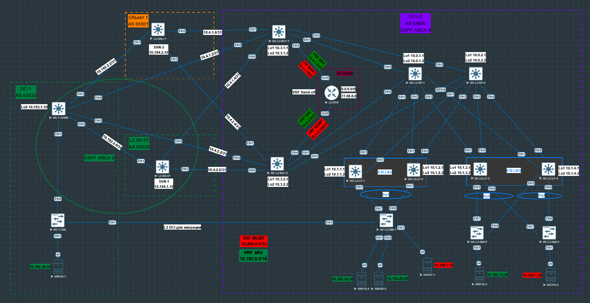
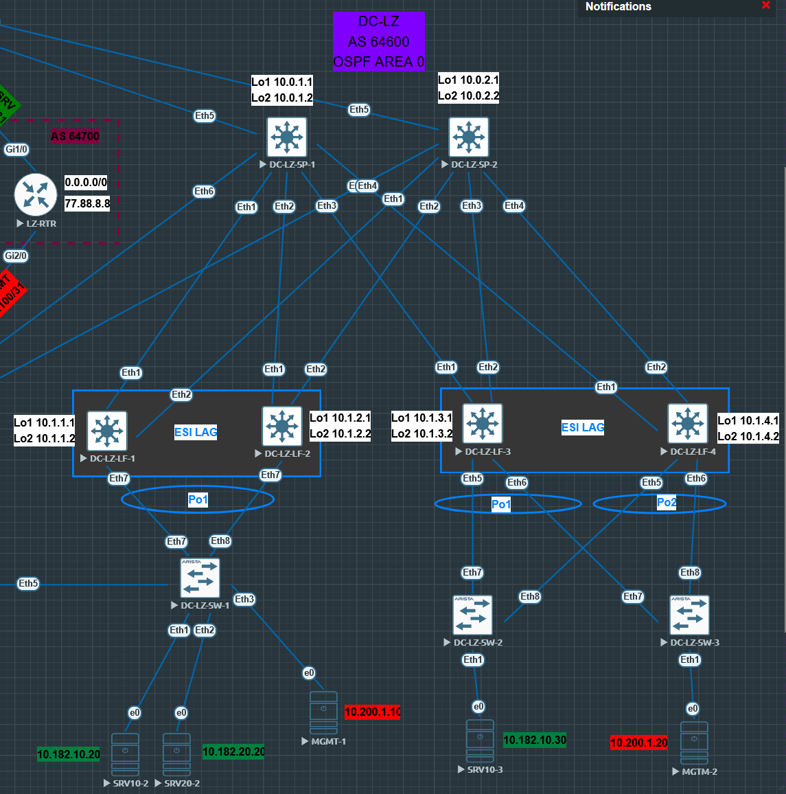
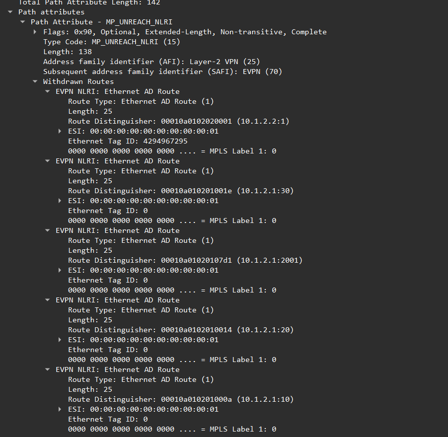

## VxLAN. Аналоги VPC

### Цель работы:
 - рассмотреть EVPN route-type 1 и 4;
 - особенности работы, основное применение.

Для лабороторной работы в Underlay будем использовать OSPF, в Overlay iBGP.

### Схема стенда
Схему для VxLAN/EVPN  будем использовать из [Проекта](https://github.com/evsboroda/otus-design-dc/tree/main/Project) так как там функционал EVPN Multihoming уже настроен.



Будем использовать данный участок сети.



Для клиентов будем использовать следующие vlan и ip сети.

|Vlan| Network|
|----|----|
|vlan 10|10.182.10.0/24|
|vlan 20|10.182.20.0/24|
|vlan 2001| 10.200.1.0/24

Таблица MAC и IP адресов АРМ.
|АРМ|Switch|MAC|IP|Port|
|---|-----|---|--|---|
|SRV10-20|DC-LZ-SW-1|00:50:00:00:0d:00|10.182.10.20|Eth1|
|SRV10-30|DC-LZ-SW-2|00:50:00:00:17:00|10.182.10.30|Eth1|
|SRV20-20|DC-Lz-SW-1|00:50:00:00:0e:00|10.182.20.20|Eth2|
|MGMT-1|DC-LZ-SW-1|00:50:00:00:13:00|10.200.1.10|Eth3|
|MGMT-2|DC-Lz-SW-2|00:50:00:00:12:00|10.200.1.20|Eth1|

### Underlay
Для Underlay настроен на OSPF.

### Overlay
Для Overlay настроен iBGP.

### EVPN Multihoming
Технология, которая позволяет подключать устройства к нескольким Leaf для повышения отказоустойчивости и возможности балансировки трафика.
Multi-Homed устройством могут выступать как  L3 устройства так и устройства подключённые по технологии LAG.
В лабороторной работе будем использовать подключение пары Leaf к коммутаторам с помощью LAG.

#### Терминалогия

Ethernet Segment (ES) - Группа линков соеденяющих PE устройства (Leaf) с Multi-Homed устройствами.
Ethernet Segment Identifier (ESI) - уникальный идентификатор Ethernet Segment'а.
Designated forwarder - узел который выбирается для каждого Ethernet Segment и ответсвенен за пересылку BUM трафика.
ES-Import RT - Дополнительное комьюнити для генерации и приёма маршрутов Route Type-4.

EVPN Multihoming использует два дополнительных типа маршрута: Route type-1 Ethernet Auto-discovery (A-D) и Route type-4 Ethernet Segment Route.
- Route type-1 - используются для автоматического обноружения PE-маршрутизаторов, анонсов ESI, анонсов массовой отмены изученных MAC адресов при выходе из стройя одного из PE устройств(mass wisthdraw).
- Route type-4 - используются для выбора DF и для обнаружения VTEP подключённых к одному и тому же Ethernet Segment.

#### Приступим к настройкам VXLAN MH.

- Сначала настроим обычный _Port-Channel_ .
```
interface Port-Channel1
   description DC-LZ-SW
   switchport trunk allowed vlan 10,20,30,2001
   switchport mode trunk
```

- Далее интерфейсу зададим н6астройки для ESI LAG.
- Укажем одинаковый `Ethernet Segment Identifier` на всех Leaf где будет это ES. 
- Укажем одинаковый `route-target import` на всех Leaf где есть данный ES.
- укажем одинаковый `lacp system-id` на всех Leaf где подключаются клиенты к этому ES, чтобы они считали, что подключены к одному устройству. 
```
evpn ethernet-segment
      identifier 0000:0000:0000:0000:0001
      route-target import 00:00:00:00:00:01
   lacp system-id 01aa.bbbb.0001
```

ESI выбирался из логики:
>Port-channel 1 = 0000:0000:0000:0000:0001\
>Port-channel 2 = 0000:0000:0000:0000:0002\

и далее по порядку.

Так же `route-target import` и `lacp system-id`зададим по попорядку. Но при желании в них можно закодировать различные идентификаторы, например: номер площадки, номер пары Leaf, номер интерфейса, вобщем всё что в голову/

- Добавим интерфейс в `Port-Channel`
- Включим LACP

```
interface Ethernet7
   description PO1_DC-LZ-SW
   channel-group 1 mode active
```
На этом настройка EVPN MH (ESI LAG) закончена. Теперь конфигурацию надо повторить на тех Leaf на которых будет этот же ES. 

### Итоговая конфигурция EVPN MH (ESI LAG) на _DC-LZ-LF-1_:

```
interface Port-Channel1
   description DC-LZ-SW
   switchport trunk allowed vlan 10,20,30,2001
   switchport mode trunk
   !
   evpn ethernet-segment
      identifier 0000:0000:0000:0000:0001
      route-target import 00:00:00:00:00:01
   lacp system-id 01aa.bbbb.0001
!
interface Ethernet7
   description PO1_DC-LZ-SW
   channel-group 1 mode active
```

Скопируем настройки на *DC-LZ-LF-2*.

Для наглядности настроим ещё на одной паре Leaf _DC-LZ-LF-3_ и _DC-LZ-LF-4_ ESI LAG.

```
interface Port-Channel1
   description SRV10-3
   switchport access vlan 10
   switchport trunk allowed vlan 10
   switchport mode trunk
   !
   evpn ethernet-segment
      identifier 0000:0000:0000:0000:0002
      route-target import 00:00:00:00:00:02
   lacp system-id 01aa.bbbb.0002
!
interface Port-Channel2
   description MGMT
   switchport access vlan 2001
   switchport trunk allowed vlan 2001
   switchport mode trunk
   !
   evpn ethernet-segment
      identifier 0000:0000:0000:0000:0003
      route-target import 00:00:00:00:00:03
   lacp system-id 01aa.bbbb.0003
!
interface Ethernet5
   description PO1_SRV10-3
   channel-group 1 mode active
!
interface Ethernet6
   description PO2_MGMT
   channel-group 2 mode active
```

##### Настроим LAG на коммутаторах доступа к которым подключаются клиенты.

- DC-LZ-SW-1

```
nterface Port-Channel1
   description PO_LF1-LF2
   switchport trunk allowed vlan 10,20,30,2001
   switchport mode trunk
!
interface Ethernet7
   description Po1_DC-LZ-LF-1
   channel-group 1 mode active
!
interface Ethernet8
   description Po1_DC-LZ-LF-2
   channel-group 1 mode active
```

- DC-LZ-SW-2

```
interface Port-Channel1
   description PO_LF3-LF4
   switchport trunk allowed vlan 10
   switchport mode trunk
!
interface Ethernet7
   description Po1_DC-LZ-LF-3
   channel-group 1 mode active
!
interface Ethernet8
   description Po1_DC-LZ-LF-4
   channel-group 1 mode active
```

- DC-LZ-SW-3

```
interface Port-Channel1
   description PO_LF3-LF4
   switchport trunk allowed vlan 2001
   switchport mode trunk
!
interface Ethernet7
   description Po1_DC-LZ-LF-3
   channel-group 1 mode active
!
interface Ethernet8
   description Po1_DC-LZ-LF-4
   channel-group 1 mode active
```

### Проверки

 - На _DC-LZ-LF-1_, посмотрим Route type 4. Видим VTEP подключённые к одному и томуже ES.

```
DC-LZ-LF-1#show bgp evpn route-type ethernet-segment 
BGP routing table information for VRF default
Router identifier 10.1.1.1, local AS number 64600
Route status codes: * - valid, > - active, S - Stale, E - ECMP head, e - ECMP
                    c - Contributing to ECMP, % - Pending BGP convergence
Origin codes: i - IGP, e - EGP, ? - incomplete
AS Path Attributes: Or-ID - Originator ID, C-LST - Cluster List, LL Nexthop - Link Local Nexthop

          Network                Next Hop              Metric  LocPref Weight  Path
 * >      RD: 10.1.1.2:1 ethernet-segment 0000:0000:0000:0000:0001 10.1.1.2
                                 -                     -       -       0       i
 * >Ec    RD: 10.1.2.2:1 ethernet-segment 0000:0000:0000:0000:0001 10.1.2.2
                                 10.1.2.2              -       100     0       i Or-ID: 10.1.2.1 C-LST: 10.0.1.1 
 *  ec    RD: 10.1.2.2:1 ethernet-segment 0000:0000:0000:0000:0001 10.1.2.2
                                 10.1.2.2              -       100     0       i Or-ID: 10.1.2.1 C-LST: 10.0.1.1 
 * >Ec    RD: 10.1.3.2:1 ethernet-segment 0000:0000:0000:0000:0002 10.1.3.2
                                 10.1.3.2              -       100     0       i Or-ID: 10.1.3.1 C-LST: 10.0.1.1 
 *  ec    RD: 10.1.3.2:1 ethernet-segment 0000:0000:0000:0000:0002 10.1.3.2
                                 10.1.3.2              -       100     0       i Or-ID: 10.1.3.1 C-LST: 10.0.1.1 
 * >Ec    RD: 10.1.4.2:1 ethernet-segment 0000:0000:0000:0000:0002 10.1.4.2
                                 10.1.4.2              -       100     0       i Or-ID: 10.1.4.1 C-LST: 10.0.1.1 
 *  ec    RD: 10.1.4.2:1 ethernet-segment 0000:0000:0000:0000:0002 10.1.4.2
                                 10.1.4.2              -       100     0       i Or-ID: 10.1.4.1 C-LST: 10.0.1.1 
 * >Ec    RD: 10.1.3.2:1 ethernet-segment 0000:0000:0000:0000:0003 10.1.3.2
                                 10.1.3.2              -       100     0       i Or-ID: 10.1.3.1 C-LST: 10.0.1.1 
 *  ec    RD: 10.1.3.2:1 ethernet-segment 0000:0000:0000:0000:0003 10.1.3.2
                                 10.1.3.2              -       100     0       i Or-ID: 10.1.3.1 C-LST: 10.0.1.1 
 * >Ec    RD: 10.1.4.2:1 ethernet-segment 0000:0000:0000:0000:0003 10.1.4.2
                                 10.1.4.2              -       100     0       i Or-ID: 10.1.4.1 C-LST: 10.0.1.1 
 *  ec    RD: 10.1.4.2:1 ethernet-segment 0000:0000:0000:0000:0003 10.1.4.2
                                 10.1.4.2              -       100     0       i Or-ID: 10.1.4.1 C-LST: 10.0.1.1 

```

<details>
<summary>Посмотрим подробный вывод. Видм что в `Extended Community` присутствует `EvpnEsImportRt` которая позволяет VTEP'ам импортировать Route type-4 маршруты только для тех сегментов которыет которые на них настроены.</summary>

```
DC-LZ-LF-1#show bgp evpn route-type ethernet-segment detail 
BGP routing table information for VRF default
Router identifier 10.1.1.1, local AS number 64600
BGP routing table entry for ethernet-segment 0000:0000:0000:0000:0001 10.1.1.2, Route Distinguisher: 10.1.1.2:1
 Paths: 1 available
  Local
    - from - (0.0.0.0)
      Origin IGP, metric -, localpref -, weight 0, tag 0, valid, local, best
      Extended Community: TunnelEncap:tunnelTypeVxlan EvpnEsImportRt:00:00:00:00:00:01
BGP routing table entry for ethernet-segment 0000:0000:0000:0000:0001 10.1.2.2, Route Distinguisher: 10.1.2.2:1
 Paths: 2 available
  Local
    10.1.2.2 from 10.0.2.1 (10.0.1.1)
      Origin IGP, metric -, localpref 100, weight 0, tag 0, valid, internal, ECMP head, ECMP, best, ECMP contributor
      Originator: 10.1.2.1, Cluster list: 10.0.1.1 
      Extended Community: TunnelEncap:tunnelTypeVxlan EvpnEsImportRt:00:00:00:00:00:01
  Local
    10.1.2.2 from 10.0.1.1 (10.0.1.1)
      Origin IGP, metric -, localpref 100, weight 0, tag 0, valid, internal, ECMP, ECMP contributor
      Originator: 10.1.2.1, Cluster list: 10.0.1.1 
      Extended Community: TunnelEncap:tunnelTypeVxlan EvpnEsImportRt:00:00:00:00:00:01
BGP routing table entry for ethernet-segment 0000:0000:0000:0000:0002 10.1.3.2, Route Distinguisher: 10.1.3.2:1
 Paths: 2 available
  Local
    10.1.3.2 from 10.0.2.1 (10.0.1.1)
      Origin IGP, metric -, localpref 100, weight 0, tag 0, valid, internal, ECMP head, ECMP, best, ECMP contributor
      Originator: 10.1.3.1, Cluster list: 10.0.1.1 
      Extended Community: TunnelEncap:tunnelTypeVxlan EvpnEsImportRt:00:00:00:00:00:02
  Local
    10.1.3.2 from 10.0.1.1 (10.0.1.1)
      Origin IGP, metric -, localpref 100, weight 0, tag 0, valid, internal, ECMP, ECMP contributor
      Originator: 10.1.3.1, Cluster list: 10.0.1.1 
      Extended Community: TunnelEncap:tunnelTypeVxlan EvpnEsImportRt:00:00:00:00:00:02
BGP routing table entry for ethernet-segment 0000:0000:0000:0000:0002 10.1.4.2, Route Distinguisher: 10.1.4.2:1
 Paths: 2 available
  Local
    10.1.4.2 from 10.0.1.1 (10.0.1.1)
      Origin IGP, metric -, localpref 100, weight 0, tag 0, valid, internal, ECMP head, ECMP, best, ECMP contributor
      Originator: 10.1.4.1, Cluster list: 10.0.1.1 
      Extended Community: TunnelEncap:tunnelTypeVxlan EvpnEsImportRt:00:00:00:00:00:02
  Local
    10.1.4.2 from 10.0.2.1 (10.0.1.1)
      Origin IGP, metric -, localpref 100, weight 0, tag 0, valid, internal, ECMP, ECMP contributor
      Originator: 10.1.4.1, Cluster list: 10.0.1.1 
      Extended Community: TunnelEncap:tunnelTypeVxlan EvpnEsImportRt:00:00:00:00:00:02
BGP routing table entry for ethernet-segment 0000:0000:0000:0000:0003 10.1.3.2, Route Distinguisher: 10.1.3.2:1
 Paths: 2 available
  Local
    10.1.3.2 from 10.0.2.1 (10.0.1.1)
      Origin IGP, metric -, localpref 100, weight 0, tag 0, valid, internal, ECMP head, ECMP, best, ECMP contributor
      Originator: 10.1.3.1, Cluster list: 10.0.1.1 
      Extended Community: TunnelEncap:tunnelTypeVxlan EvpnEsImportRt:00:00:00:00:00:03
  Local
    10.1.3.2 from 10.0.1.1 (10.0.1.1)
      Origin IGP, metric -, localpref 100, weight 0, tag 0, valid, internal, ECMP, ECMP contributor
      Originator: 10.1.3.1, Cluster list: 10.0.1.1 
      Extended Community: TunnelEncap:tunnelTypeVxlan EvpnEsImportRt:00:00:00:00:00:03
BGP routing table entry for ethernet-segment 0000:0000:0000:0000:0003 10.1.4.2, Route Distinguisher: 10.1.4.2:1
 Paths: 2 available
  Local
    10.1.4.2 from 10.0.2.1 (10.0.1.1)
      Origin IGP, metric -, localpref 100, weight 0, tag 0, valid, internal, ECMP head, ECMP, best, ECMP contributor
      Originator: 10.1.4.1, Cluster list: 10.0.1.1 
      Extended Community: TunnelEncap:tunnelTypeVxlan EvpnEsImportRt:00:00:00:00:00:03
  Local
    10.1.4.2 from 10.0.1.1 (10.0.1.1)
      Origin IGP, metric -, localpref 100, weight 0, tag 0, valid, internal, ECMP, ECMP contributor
      Originator: 10.1.4.1, Cluster list: 10.0.1.1 
      Extended Community: TunnelEncap:tunnelTypeVxlan EvpnEsImportRt:00:00:00:00:00:03
```
</details>

<details>
<summary> Посмотрим вывод `bgp evpn instance` на *DC-LZ-LF-1*. Видим к каким EVI подключён VTEP. Так же видим для каждого EVI DF.

```
DC-LZ-LF-1#show bgp evpn instance 
EVPN instance: VLAN 10
  Route distinguisher: 0:0
  Route target import: Route-Target-AS:10:1010
  Route target export: Route-Target-AS:10:1010
  Service interface: VLAN-based
  Local VXLAN IP address: 10.1.1.2
  VXLAN: enabled
  MPLS: disabled
  Local ethernet segment:
    ESI: 0000:0000:0000:0000:0001
      Interface: Port-Channel1
      Mode: all-active
      State: up
      ES-Import RT: 00:00:00:00:00:01
      DF election algorithm: modulus
      Designated forwarder: 10.1.1.2
      Non-Designated forwarder: 10.1.2.2
EVPN instance: VLAN 20
  Route distinguisher: 0:0
  Route target import: Route-Target-AS:20:1020
  Route target export: Route-Target-AS:20:1020
  Service interface: VLAN-based
  Local VXLAN IP address: 10.1.1.2
  VXLAN: enabled
  MPLS: disabled
  Local ethernet segment:
    ESI: 0000:0000:0000:0000:0001
      Interface: Port-Channel1
      Mode: all-active
      State: up
      ES-Import RT: 00:00:00:00:00:01
      DF election algorithm: modulus
      Designated forwarder: 10.1.1.2
      Non-Designated forwarder: 10.1.2.2
EVPN instance: VLAN 2001
  Route distinguisher: 0:0
  Route target import: Route-Target-AS:2001:1010
  Route target export: Route-Target-AS:2001:1010
  Service interface: VLAN-based
  Local VXLAN IP address: 10.1.1.2
  VXLAN: enabled
  MPLS: disabled
  Local ethernet segment:
    ESI: 0000:0000:0000:0000:0001
      Interface: Port-Channel1
      Mode: all-active
      State: up
      ES-Import RT: 00:00:00:00:00:01
      DF election algorithm: modulus
      Designated forwarder: 10.1.2.2
      Non-Designated forwarder: 10.1.1.2
EVPN instance: VLAN 30
  Route distinguisher: 0:0
  Route target import: Route-Target-AS:30:1030
  Route target export: Route-Target-AS:30:1030
  Service interface: VLAN-based
  Local VXLAN IP address: 10.1.1.2
  VXLAN: enabled
  MPLS: disabled
  Local ethernet segment:
    ESI: 0000:0000:0000:0000:0001
      Interface: Port-Channel1
      Mode: all-active
      State: up
      ES-Import RT: 00:00:00:00:00:01
      DF election algorithm: modulus
      Designated forwarder: 10.1.1.2
      Non-Designated forwarder: 10.1.2.2
```
</summary>

На _DC-LZ-LF-1_, посмотрим Route type 1. Видим VTEP подключенные к одним и тем же EVi.

```
DC-LZ-LF-1#show bgp evpn route-type auto-discovery
BGP routing table information for VRF default
Router identifier 10.1.1.1, local AS number 64600
Route status codes: * - valid, > - active, S - Stale, E - ECMP head, e - ECMP
                    c - Contributing to ECMP, % - Pending BGP convergence
Origin codes: i - IGP, e - EGP, ? - incomplete
AS Path Attributes: Or-ID - Originator ID, C-LST - Cluster List, LL Nexthop - Link Local Nexthop

          Network                Next Hop              Metric  LocPref Weight  Path
 * >      RD: 10.1.1.1:10 auto-discovery 0 0000:0000:0000:0000:0001
                                 -                     -       -       0       i
 * >      RD: 10.1.1.1:20 auto-discovery 0 0000:0000:0000:0000:0001
                                 -                     -       -       0       i
 * >      RD: 10.1.1.1:30 auto-discovery 0 0000:0000:0000:0000:0001
                                 -                     -       -       0       i
 * >      RD: 10.1.1.1:2001 auto-discovery 0 0000:0000:0000:0000:0001
                                 -                     -       -       0       i
 * >Ec    RD: 10.1.2.1:10 auto-discovery 0 0000:0000:0000:0000:0001
                                 10.1.2.2              -       100     0       i Or-ID: 10.1.2.1 C-LST: 10.0.1.1 
 *  ec    RD: 10.1.2.1:10 auto-discovery 0 0000:0000:0000:0000:0001
                                 10.1.2.2              -       100     0       i Or-ID: 10.1.2.1 C-LST: 10.0.1.1 
 * >Ec    RD: 10.1.2.1:20 auto-discovery 0 0000:0000:0000:0000:0001
                                 10.1.2.2              -       100     0       i Or-ID: 10.1.2.1 C-LST: 10.0.1.1 
 *  ec    RD: 10.1.2.1:20 auto-discovery 0 0000:0000:0000:0000:0001
                                 10.1.2.2              -       100     0       i Or-ID: 10.1.2.1 C-LST: 10.0.1.1 
 * >Ec    RD: 10.1.2.1:30 auto-discovery 0 0000:0000:0000:0000:0001
                                 10.1.2.2              -       100     0       i Or-ID: 10.1.2.1 C-LST: 10.0.1.1 
 *  ec    RD: 10.1.2.1:30 auto-discovery 0 0000:0000:0000:0000:0001
                                 10.1.2.2              -       100     0       i Or-ID: 10.1.2.1 C-LST: 10.0.1.1 
 * >Ec    RD: 10.1.2.1:2001 auto-discovery 0 0000:0000:0000:0000:0001
                                 10.1.2.2              -       100     0       i Or-ID: 10.1.2.1 C-LST: 10.0.1.1 
 *  ec    RD: 10.1.2.1:2001 auto-discovery 0 0000:0000:0000:0000:0001
                                 10.1.2.2              -       100     0       i Or-ID: 10.1.2.1 C-LST: 10.0.1.1 
 * >      RD: 10.1.1.2:1 auto-discovery 0000:0000:0000:0000:0001
                                 -                     -       -       0       i
 * >Ec    RD: 10.1.2.2:1 auto-discovery 0000:0000:0000:0000:0001
                                 10.1.2.2              -       100     0       i Or-ID: 10.1.2.1 C-LST: 10.0.1.1 
 *  ec    RD: 10.1.2.2:1 auto-discovery 0000:0000:0000:0000:0001
                                 10.1.2.2              -       100     0       i Or-ID: 10.1.2.1 C-LST: 10.0.1.1 
 * >Ec    RD: 10.1.3.1:10 auto-discovery 0 0000:0000:0000:0000:0002
                                 10.1.3.2              -       100     0       i Or-ID: 10.1.3.1 C-LST: 10.0.1.1 
 *  ec    RD: 10.1.3.1:10 auto-discovery 0 0000:0000:0000:0000:0002
                                 10.1.3.2              -       100     0       i Or-ID: 10.1.3.1 C-LST: 10.0.1.1 
 * >Ec    RD: 10.1.4.1:10 auto-discovery 0 0000:0000:0000:0000:0002
                                 10.1.4.2              -       100     0       i Or-ID: 10.1.4.1 C-LST: 10.0.1.1 
 *  ec    RD: 10.1.4.1:10 auto-discovery 0 0000:0000:0000:0000:0002
                                 10.1.4.2              -       100     0       i Or-ID: 10.1.4.1 C-LST: 10.0.1.1 
 * >Ec    RD: 10.1.3.2:1 auto-discovery 0000:0000:0000:0000:0002
                                 10.1.3.2              -       100     0       i Or-ID: 10.1.3.1 C-LST: 10.0.1.1 
 *  ec    RD: 10.1.3.2:1 auto-discovery 0000:0000:0000:0000:0002
                                 10.1.3.2              -       100     0       i Or-ID: 10.1.3.1 C-LST: 10.0.1.1 
 * >Ec    RD: 10.1.4.2:1 auto-discovery 0000:0000:0000:0000:0002
                                 10.1.4.2              -       100     0       i Or-ID: 10.1.4.1 C-LST: 10.0.1.1 
 *  ec    RD: 10.1.4.2:1 auto-discovery 0000:0000:0000:0000:0002
                                 10.1.4.2              -       100     0       i Or-ID: 10.1.4.1 C-LST: 10.0.1.1 
 * >Ec    RD: 10.1.3.1:2001 auto-discovery 0 0000:0000:0000:0000:0003
                                 10.1.3.2              -       100     0       i Or-ID: 10.1.3.1 C-LST: 10.0.1.1 
 *  ec    RD: 10.1.3.1:2001 auto-discovery 0 0000:0000:0000:0000:0003
                                 10.1.3.2              -       100     0       i Or-ID: 10.1.3.1 C-LST: 10.0.1.1 
 * >Ec    RD: 10.1.4.1:2001 auto-discovery 0 0000:0000:0000:0000:0003
                                 10.1.4.2              -       100     0       i Or-ID: 10.1.4.1 C-LST: 10.0.1.1 
 *  ec    RD: 10.1.4.1:2001 auto-discovery 0 0000:0000:0000:0000:0003
                                 10.1.4.2              -       100     0       i Or-ID: 10.1.4.1 C-LST: 10.0.1.1 
 * >Ec    RD: 10.1.3.2:1 auto-discovery 0000:0000:0000:0000:0003
                                 10.1.3.2              -       100     0       i Or-ID: 10.1.3.1 C-LST: 10.0.1.1 
 *  ec    RD: 10.1.3.2:1 auto-discovery 0000:0000:0000:0000:0003
                                 10.1.3.2              -       100     0       i Or-ID: 10.1.3.1 C-LST: 10.0.1.1 
 * >Ec    RD: 10.1.4.2:1 auto-discovery 0000:0000:0000:0000:0003
                                 10.1.4.2              -       100     0       i Or-ID: 10.1.4.1 C-LST: 10.0.1.1 
 *  ec    RD: 10.1.4.2:1 auto-discovery 0000:0000:0000:0000:0003
                                 10.1.4.2              -       100     0       i Or-ID: 10.1.4.1 C-LST: 10.0.1.1 
```

<details>
<summary>Подробный вывод Route type-1</summary>

```
DC-LZ-LF-1#show bgp evpn route-type ethernet-segment detail 
BGP routing table information for VRF default
Router identifier 10.1.1.1, local AS number 64600
BGP routing table entry for ethernet-segment 0000:0000:0000:0000:0001 10.1.1.2, Route Distinguisher: 10.1.1.2:1
 Paths: 1 available
  Local
    - from - (0.0.0.0)
      Origin IGP, metric -, localpref -, weight 0, tag 0, valid, local, best
      Extended Community: TunnelEncap:tunnelTypeVxlan EvpnEsImportRt:00:00:00:00:00:01
BGP routing table entry for ethernet-segment 0000:0000:0000:0000:0001 10.1.2.2, Route Distinguisher: 10.1.2.2:1
 Paths: 2 available
  Local
    10.1.2.2 from 10.0.2.1 (10.0.1.1)
      Origin IGP, metric -, localpref 100, weight 0, tag 0, valid, internal, ECMP head, ECMP, best, ECMP contributor
      Originator: 10.1.2.1, Cluster list: 10.0.1.1 
      Extended Community: TunnelEncap:tunnelTypeVxlan EvpnEsImportRt:00:00:00:00:00:01
  Local
    10.1.2.2 from 10.0.1.1 (10.0.1.1)
      Origin IGP, metric -, localpref 100, weight 0, tag 0, valid, internal, ECMP, ECMP contributor
      Originator: 10.1.2.1, Cluster list: 10.0.1.1 
      Extended Community: TunnelEncap:tunnelTypeVxlan EvpnEsImportRt:00:00:00:00:00:01
BGP routing table entry for ethernet-segment 0000:0000:0000:0000:0002 10.1.3.2, Route Distinguisher: 10.1.3.2:1
 Paths: 2 available
  Local
    10.1.3.2 from 10.0.2.1 (10.0.1.1)
      Origin IGP, metric -, localpref 100, weight 0, tag 0, valid, internal, ECMP head, ECMP, best, ECMP contributor
      Originator: 10.1.3.1, Cluster list: 10.0.1.1 
      Extended Community: TunnelEncap:tunnelTypeVxlan EvpnEsImportRt:00:00:00:00:00:02
  Local
    10.1.3.2 from 10.0.1.1 (10.0.1.1)
      Origin IGP, metric -, localpref 100, weight 0, tag 0, valid, internal, ECMP, ECMP contributor
      Originator: 10.1.3.1, Cluster list: 10.0.1.1 
      Extended Community: TunnelEncap:tunnelTypeVxlan EvpnEsImportRt:00:00:00:00:00:02
BGP routing table entry for ethernet-segment 0000:0000:0000:0000:0002 10.1.4.2, Route Distinguisher: 10.1.4.2:1
 Paths: 2 available
  Local
    10.1.4.2 from 10.0.1.1 (10.0.1.1)
      Origin IGP, metric -, localpref 100, weight 0, tag 0, valid, internal, ECMP head, ECMP, best, ECMP contributor
      Originator: 10.1.4.1, Cluster list: 10.0.1.1 
      Extended Community: TunnelEncap:tunnelTypeVxlan EvpnEsImportRt:00:00:00:00:00:02
  Local
    10.1.4.2 from 10.0.2.1 (10.0.1.1)
      Origin IGP, metric -, localpref 100, weight 0, tag 0, valid, internal, ECMP, ECMP contributor
      Originator: 10.1.4.1, Cluster list: 10.0.1.1 
      Extended Community: TunnelEncap:tunnelTypeVxlan EvpnEsImportRt:00:00:00:00:00:02
BGP routing table entry for ethernet-segment 0000:0000:0000:0000:0003 10.1.3.2, Route Distinguisher: 10.1.3.2:1
 Paths: 2 available
  Local
    10.1.3.2 from 10.0.2.1 (10.0.1.1)
      Origin IGP, metric -, localpref 100, weight 0, tag 0, valid, internal, ECMP head, ECMP, best, ECMP contributor
      Originator: 10.1.3.1, Cluster list: 10.0.1.1 
      Extended Community: TunnelEncap:tunnelTypeVxlan EvpnEsImportRt:00:00:00:00:00:03
  Local
    10.1.3.2 from 10.0.1.1 (10.0.1.1)
      Origin IGP, metric -, localpref 100, weight 0, tag 0, valid, internal, ECMP, ECMP contributor
      Originator: 10.1.3.1, Cluster list: 10.0.1.1 
      Extended Community: TunnelEncap:tunnelTypeVxlan EvpnEsImportRt:00:00:00:00:00:03
BGP routing table entry for ethernet-segment 0000:0000:0000:0000:0003 10.1.4.2, Route Distinguisher: 10.1.4.2:1
 Paths: 2 available
  Local
    10.1.4.2 from 10.0.2.1 (10.0.1.1)
      Origin IGP, metric -, localpref 100, weight 0, tag 0, valid, internal, ECMP head, ECMP, best, ECMP contributor
      Originator: 10.1.4.1, Cluster list: 10.0.1.1 
      Extended Community: TunnelEncap:tunnelTypeVxlan EvpnEsImportRt:00:00:00:00:00:03
  Local
    10.1.4.2 from 10.0.1.1 (10.0.1.1)
      Origin IGP, metric -, localpref 100, weight 0, tag 0, valid, internal, ECMP, ECMP contributor
      Originator: 10.1.4.1, Cluster list: 10.0.1.1 
      Extended Community: TunnelEncap:tunnelTypeVxlan EvpnEsImportRt:00:00:00:00:00:03
```
</details>

Проверим состояния LACP интерфейсов *Port-channel* 

#### DC-LZ-SW-1

LACP активен.

```
DC-LZ-SW-1#show lacp 
% Incomplete command
DC-LZ-SW-1#show lacp peer 
State: A = Active, P = Passive; S=ShortTimeout, L=LongTimeout;
       G = Aggregable, I = Individual; s+=InSync, s-=OutOfSync;
       C = Collecting, X = state machine expired,
       D = Distributing, d = default neighbor state
                 |                        Partner                              
 Port    Status  | Sys-id                    Port#   State     OperKey  PortPri
------ ----------|------------------------- ------- --------- --------- -------
Port Channel Port-Channel1:                                            
 Et7     Bundled | 8000,01-aa-bb-bb-00-01        7   ALGs+CD    0x0001    32768
 Et8     Bundled | 8000,01-aa-bb-bb-00-01        7   ALGs+CD    0x0001    32768
```

#### DC-LZ-SW-2

LACP активен.

```
DC-LZ-SW-2#show lacp peer 
State: A = Active, P = Passive; S=ShortTimeout, L=LongTimeout;
       G = Aggregable, I = Individual; s+=InSync, s-=OutOfSync;
       C = Collecting, X = state machine expired,
       D = Distributing, d = default neighbor state
                 |                        Partner                              
 Port    Status  | Sys-id                    Port#   State     OperKey  PortPri
------ ----------|------------------------- ------- --------- --------- -------
Port Channel Port-Channel1:                                            
 Et7     Bundled | 8000,01-aa-bb-bb-00-02        5   ALGs+CD    0x0001    32768
 Et8     Bundled | 8000,01-aa-bb-bb-00-02        5   ALGs+CD    0x0001    32768
```

#### DC-LZ-SW-3

LACP активен.

```
DC-LZ-SW-3#show lacp peer 
State: A = Active, P = Passive; S=ShortTimeout, L=LongTimeout;
       G = Aggregable, I = Individual; s+=InSync, s-=OutOfSync;
       C = Collecting, X = state machine expired,
       D = Distributing, d = default neighbor state
                 |                        Partner                              
 Port    Status  | Sys-id                    Port#   State     OperKey  PortPri
------ ----------|------------------------- ------- --------- --------- -------
Port Channel Port-Channel1:                                            
 Et7     Bundled | 8000,01-aa-bb-bb-00-03        6   ALGs+CD    0x0002    32768
 Et8     Bundled | 8000,01-aa-bb-bb-00-03        6   ALGs+CD    0x0002    32768
```

### Проверки ping.

Ping SRV10-20 -> SRV10-30 со всеми активными линками.

```
PING 10.182.10.30 (10.182.10.30) 56(84) bytes of data.
64 bytes from 10.182.10.30: icmp_seq=1 ttl=64 time=88.0 ms
64 bytes from 10.182.10.30: icmp_seq=2 ttl=64 time=82.9 ms
64 bytes from 10.182.10.30: icmp_seq=3 ttl=64 time=88.6 ms
64 bytes from 10.182.10.30: icmp_seq=4 ttl=64 time=80.3 ms
64 bytes from 10.182.10.30: icmp_seq=5 ttl=64 time=80.9 ms
^C
--- 10.182.10.30 ping statistics ---
5 packets transmitted, 5 received, 0% packet loss, time 4006ms
rtt min/avg/max/mdev = 80.316/84.141/88.600/3.500 ms
```

Запустим пинг между SRV10-2 и SRV10-30. На *DC-LZ-LF-2* выключим интрефейс Eth7 в сторону *DC-LZ-SW-1* и посмотрим что будет.

```
[1739628038.029808] 64 bytes from 10.182.10.30: icmp_seq=35 ttl=64 time=89.6 ms
[1739628039.028188] 64 bytes from 10.182.10.30: icmp_seq=36 ttl=64 time=87.5 ms
[1739628040.030650] 64 bytes from 10.182.10.30: icmp_seq=37 ttl=64 time=89.8 ms
[1739628041.029426] 64 bytes from 10.182.10.30: icmp_seq=38 ttl=64 time=87.9 ms
[1739628042.965944] no answer yet for icmp_seq=39
[1739628043.068035] 64 bytes from 10.182.10.30: icmp_seq=40 ttl=64 time=101 ms
[1739628044.056136] 64 bytes from 10.182.10.30: icmp_seq=41 ttl=64 time=89.4 ms
[1739628045.069319] 64 bytes from 10.182.10.30: icmp_seq=42 ttl=64 time=102 ms
[1739628046.061744] 64 bytes from 10.182.10.30: icmp_seq=43 ttl=64 time=94.3 ms
[1739628047.095877] 64 bytes from 10.182.10.30: icmp_seq=44 ttl=64 time=127 ms
[1739628048.056336] 64 bytes from 10.182.10.30: icmp_seq=45 ttl=64 time=87.7 ms
[1739628049.079367] 64 bytes from 10.182.10.30: icmp_seq=46 ttl=64 time=111 ms
[1739628050.064149] 64 bytes from 10.182.10.30: icmp_seq=47 ttl=64 time=95.1 ms
```

Пропал один пинг. А так же произошёл массовый отзыв маршрутов через *DC-LZ-LF-2* по средствам RT-1.



Проверки на паре *DC-LZ-LF-3* и *DC-LZ-LF-4* преводить не буду. Картина будет схожей.

Итог: Настроили EVPN Multihoming. Получили отказоустойчивое подключение клиентов по средствам LAG к Leaf. Проверили маршруты RT-1 и RT-4.


