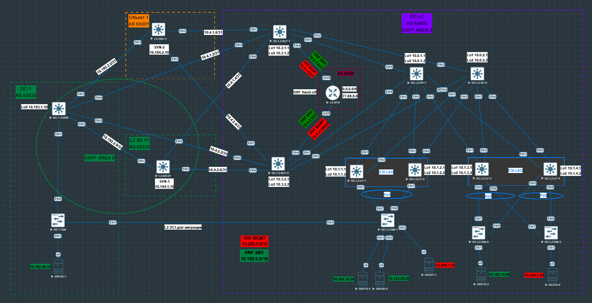

## VxLAN. Оптимизация таблиц маршрутизации 

### Цель работы:
 - разобрать EVPN route-type 5 и его применение;
 - настройка route-type для оптимизации маршрутизации.

Для лабороторной работы в Underlay будем использовать OSPF, в Overlay iBGP.

### Схема стенда
Схему для VxLAN/EVPN  будем использовать из [Проекта](https://github.com/evsboroda/otus-design-dc/tree/main/Project).

Будем использовать данный участок сети.

Для клиентов будем использовать следующие vlan и ip сети.

|Vlan| Network| VRF |
|----|----| ---- |
|vlan 10|10.182.10.0/24| SRV |
|vlan 20|10.182.20.0/24| SRV |
|vlan 2001| 10.200.1.0/24| MGMT |

Таблица MAC и IP адресов АРМ.
|АРМ|Switch|MAC|IP|Port|
|---|-----|---|--|---|
|SRV10-20|DC-LZ-SW-1|00:50:00:00:0d:00|10.182.10.20|Eth1|
|SRV10-30|DC-LZ-SW-2|00:50:00:00:17:00|10.182.10.30|Eth1|
|SRV20-20|DC-Lz-SW-1|00:50:00:00:0e:00|10.182.20.20|Eth2|
|MGMT-1|DC-LZ-SW-1|00:50:00:00:13:00|10.200.1.10|Eth3|
|MGMT-2|DC-Lz-SW-2|00:50:00:00:12:00|10.200.1.20|Eth1|

### Underlay
Для Underlay настроен на OSPF.

### Overlay
Для Overlay настроен iBGP.

### EVPN Route type 5: IP Prefix Route
Технология, которая позволяет подключать устройства к нескольким Leaf для повышения отказоустойчивости и возможности балансировки трафика.
Multi-Homed устройством могут выступать как  L3 устройства так и устройства подключённые по технологии LAG.
В лабороторной работе будем использовать подключение пары Leaf к коммутаторам с помощью LAG.