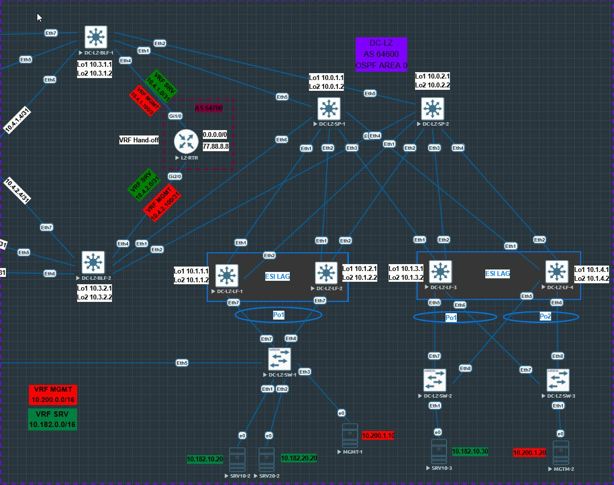

## VxLAN. Оптимизация таблиц маршрутизации 

### Цель работы:
 - разобрать EVPN route-type 5 и его применение;
 - настройка route-type для оптимизации маршрутизации.

Для лабороторной работы в Underlay будем использовать OSPF, в Overlay iBGP.

### Схема стенда
Схему для VxLAN/EVPN  будем использовать из [Проекта](https://github.com/evsboroda/otus-design-dc/tree/main/Project).


Будем использовать данный участок сети.



В нашей схеме появились новые устройства: Border Leaf - *DC-LZ-BLF1* и *DC-LZ-BLF-2* для внешних подключений и *DC-LZ-RTR* - маршрутизатор на котором будем осуществлять vrf leaking - маршрутизацию между vrf, так называемый Hand off. Так же на этом маршрутизаторе мы будем обьявлять маршрут по умолчанию.

### Номера автономных систем.

|Площадка|AS|
|----|----|
|DC-LZ| 64600|
|DC-LZ-RTR|64700|

#### Loopback адреса

| **Device** | **Loopback1** | **Loopback2** | 
| --- | --- | --- |
| **DC-LZ-SP-1** | 10.0.1.1/32 | 10.0.1.2/32 |
| **DC-LZ-SP-2** | 10.0.2.1/32 | 10.0.2.2/32 | 
| **DC-LZ-LF-1** | 10.1.1.1/32 | 10.1.1.2/32 | 
| **DC-LZ-LF-2** | 10.1.2.1/32 | 10.1.2.2/32 | 
| **DC-LZ-LF-3** | 10.1.3.1/32 | 10.1.3.2/32 | 
| **DC-LZ-LF-4** | 10.1.4.1/32 | 10.1.4.2/32 | 
| **DC-LZ-BLF-1** | 10.3.1.1/32 | 10.3.1.2/32 | 
|**DC-LZ-BLF-2**|10.3.2.1/32| 10.3.2.2/32|
| **DC-LZ-RTR** |10.4.0.1/32| 10.4.0.2/32|

#### Подсети для p2p линков на Spine

| **Device** | **DC-LZ-LF-1** | **DC-LZ-LF-2** |**DC-LZ-LF-3** | **DC-LZ-LF-4**| **DC-LZ-BLF-1** | **DC-LZ-BLF-2**|
| --- | --- | --- | --- |---|---|---|
| **DC-LZ-SP-1** | 10.2.1.0/31 | 10.2.1.2/31 |10.2.1.4/31|10.2.1.6/31|10.2.1.100/31 | 10.2.1.102/31|
| **DC-LZ-SP-2** | 10.2.2.0/31 | 10.2.2.2/31 |10.2.1.4/31|10.2.1.6/31|10.2.2.100/31 | 10.2.2.102/31|

#### Подсети для p2p линков на Border Leaf для внешних соединений 

| **Device** | **VRF**|**DC-LZ-RTR** |  
| --- | --- | --- |
| **DC-LZ-BLF-1** |SRV| 10.4.1.0/31 | 
|                 |MGMT| 10.4.1.100/31 | 
| **DC-LZ-BLF-2** |SRV|10.4.2.0/31 | 
|                 |MGMT| 10.4.2.100/31 |

#### адреса p2p на интерфейсах

| **Device** | **Порт** | **название** | **Адрес** | **Маска** |
| --- | --- | --- | --- | --- |
| **DC-LZ-SP-1** | Et1 | DC-LZ-LF-1 | 10.2.1.0 | 255.255.255.254 |
|     | Et2 | DC-LZ-LF-2 | 10.2.1.2 | 255.255.255.254 |
|     | Et3 | DC-LZ-LF-3 | 10.2.1.4 | 255.255.255.254 |
|     | Et4 | DC-LZ-LF-4 | 10.2.1.6 | 255.255.255.254 |
|     | Et5 | DC-LZ-BLF-1 | 10.2.1.100 | 255.255.255.254 |
|     | Et6 | DC-LZ-BLF-2 | 10.2.1.102 | 255.255.255.254 |10.1
| **DC-LZ-SP-2** | Et1 | DCN-LF-1 | 10.2.2.0 | 255.255.255.254 |
|     | Et2 | DC-LZ-LF-2 | 10.2.2.2 | 255.255.255.254 |
|     | Et3 | DC-LZ-LF-3 | 10.2.2.4 | 255.255.255.254 |
|     | Et4 | DC-LZ-LF-4 | 10.2.2.6 | 255.255.255.254 |
|     | Et5 | DC-LZ-BLF-1 | 10.2.2.100 | 255.255.255.254 |
|     | Et6 | DC-LZ-BLF-2 | 10.2.2.102 | 255.255.255.254 |
| **DC-LZ-LF-1** | Et1 | DC-L-SP.1 | 10.2.1.1 | 255.255.255.254 |
|     | Et2 | DC-LZ-SP-2 | 10.2.2.1 | 255.255.255.254 |
| **DC-LZ-LF-2** | Et1 | DC-L-SP-1 | 10.2.1.3 | 255.255.255.254 |
|     | Et2 | DC-LZ-SP-2 | 10.2.2.3 | 255.255.255.254 |
| **DC-LZ-LF-3** | Et1 | DC-L-SP-1 | 10.2.1.5 | 255.255.255.254 |
|     | Et2 | DC-LZ-SP-2 | 10.2.2.5 | 255.255.255.254 |
| **DC-LZ-LF-4** | Et1 | DC-L-SP-1 | 10.2.1.7 | 255.255.255.254 |
|     | Et2 | DC-LZ-SP-2 | 10.2.2.7 | 255.255.255.254 |
| **DC-LZ-BLF-1** | Et1 | DC-L-SP-1 | 10.2.1.5 | 255.255.255.254 |
|     | Et2 | DC-LZ-SP-2 | 10.2.2.5 | 255.255.255.254 |
|     | Et4.500 | DC-LZ-RTR_VRF_SRV | 10.4.1.0 | 255.255.255.254 |
|     | Et4.600 | DC-LZ-RTR_VRF_MGMT | 10.4.1.100 | 255.255.255.254 |
| **DC-LZ-BLF-2**| Et1 | DC-L-SP-1 | 10.2.1.7 | 255.255.255.254 |
|     | Et2 | DC-LZ-SP-2 | 10.2.2.7 | 255.255.255.254 |
|     | Et4.500 | DC-LZ-RTR_VRF_SRV | 10.4.2.0 | 255.255.255.254 |
|     | Et4.600 | DC-LZ-RTR_VRF_MGMT | 10.4.2.100 | 255.255.255.254 |
| **DC-LZ-RTR** | Gi1/0.500 | DC-LZ-BLF-1_VRF_SRV | 10.4.1.1 | 255.255.255.254 |
|     | Gi1/0.600 | DC-LZ-BLF-2_VRF_SRV | 10.4.2.101 | 255.255.255.254 |
|     | Gi2/0.500 | DC-LZ-BLF-2_VRF_SRV | 10.4.2.1 | 255.255.255.254 |
|     | Gi2/0.600 | DC-LZ-BLF-2_VRF_MGMT | 10.4.2.101 | 255.255.255.254 |

### распределение vni

| vni | назначение| VLAN|VRF |
|-----|-----------|-----|-----|
|10| L2VNI |vlan 10 | SRV
|20| L2VNI| vlan 20 | SRV
|30| L2VNI| vlan 30 | SRV
|2001| L2VNI|vlan 2001| MGMT
|5000| L3VNI| | SRV |
|6000| L3VNI| | MGMT|

Для клиентов будем использовать следующие vlan и ip сети.

|Vlan| Network| VRF |
|----|----| ---- |
|vlan 10|10.182.10.0/24| SRV |
|vlan 20|10.182.20.0/24| SRV |
|vlan 2001| 10.200.1.0/24| MGMT |

### Underlay
Для Underlay настроен на OSPF.

### Overlay
Для Overlay настроен iBGP.

### EVPN Route type 5: IP Prefix Route
Маршруты EVPN Route type 5 предоставляют механизм передавать IPv4 и IPv6 префиксы на всю сеть, в отличие от Route type 2, где передаётся информация только MAC-IP. Позволяют анонсировать внешние IP префиксы полученные из различных протоклов маршрутизации для выхода из EVPN фабрики. Так же используются для маршрутизации между IP-VRF в EVPN.

### Приступим к настройкам на Leaf.

Сперва настроим весь функционал VXLAN.

- настроим VLAN.

```
vlan 10
   name SRV10
!
vlan 20
   name SRV20
!
vlan 30
   name SRV30
!
vlan 2001
   name MGMT
```

- Создадим нужные нам VRF.

```
vrf instance MGMT
!
vrf instance SRV
```

- Включим маршрутизацию в VRF.

```
ip routing vrf MGMT
ip routing vrf SRV
```

- Создадим Vxlan интерфейс.
- назначим vni для каждого vlan.
- Создадим L3VNI для каждого VRF. 

```
interface Vxlan1
   vxlan source-interface Loopback2
   vxlan udp-port 4789
   vxlan vlan 10 vni 10
   vxlan vlan 20 vni 20
   vxlan vlan 30 vni 30
   vxlan vlan 2001 vni 2001
   vxlan vrf MGMT vni 6000
   vxlan vrf SRV vni 5000
```

- В процессе BGP настроим MAC-VRF
- Настроим IP-VRF

```
router bgp 64600
   vlan 10
      rd auto
      route-target both 10:1010
      redistribute learned
   !
   vlan 20
      rd auto
      route-target both 20:1020
      redistribute learned
   !
   vlan 2001
      rd auto
      route-target both 2001:1010
      redistribute learned
   !
   vlan 30
      rd auto
      route-target both 30:1030
      redistribute learned
   !
   address-family evpn
      neighbor SPINES activate
   !
   address-family ipv4
      no neighbor SPINES activate
   !
   vrf MGMT
      rd 10.1.1.1:6000
      route-target import evpn 6000:6000
      route-target export evpn 6000:6000
      redistribute connected
   !
   vrf SRV
      rd 10.1.1.1:5000
      route-target import evpn 5000:5000
      route-target export evpn 5000:5000
      redistribute connected
```

Общие настройки VXLAN/EVPN для **Leaf** на этом закончены. Распростаним конфигурацию по **Leaf** меняя только RD в секции 'VRF'

#### Итоговые конфигурации Leaf

[DC-LZ-LF-1](Configs/DC-LZ-LF-1.txt)

[DC-LZ-LF-2](Configs/DC-LZ-LF-2.txt)

[DC-LZ-LF-3](Configs/DC-LZ-LF-3.txt)

[DC-LZ-LF-4](Configs/DC-LZ-LF-4.txt)

### Теперь настроим Border Leaf.

Соседство с DC-LZ-RTR будем строить на sub-interface.

- для VRF SRV будем использовать vlan 500
- для VRF MGMT будем использовать vlan 600

```
interface Ethernet4
   description DC-LZ-RTR
   no switchport
!
interface Ethernet4.500
   description VRF_SRV
   encapsulation dot1q vlan 500
   vrf SRV
   ip address 10.4.1.0/31
!
interface Ethernet4.600
   description VRF_MGMT
   encapsulation dot1q vlan 600
   vrf MGMT
   ip address 10.4.1.100/31
```

 - настройки vlan, vrf и интерфейс vxlan на Border leaf не отличаются от настроек на Leaf.

```
vlan 10
   name SRV10
!
vlan 20
   name SRV20
!
vlan 2001
   name MGMT
!
vrf instance MGMT
!
vrf instance SRV
!
ip routing vrf MGMT
ip routing vrf SRV
!
interface Vxlan1
   vxlan source-interface Loopback2
   vxlan udp-port 4789
   vxlan vlan 10 vni 10
   vxlan vlan 20 vni 20
   vxlan vrf MGMT vni 6000
   vxlan vrf SRV vni 5000
```

Основные настройки BGP Border Leaf для Spine пропустим, они не будут отличаться от настроек на Leaf из прошлых Лабораторных.

### Основыне моменты

- Будем использовать eBGP.
- Создадим peer group для *DC-LZ-RTR*
- Активируем AF IPv4 для для Peer Group *DC-LZ-RTR*
- Настроим IP-VRF для каждого VRF.
- внутри каждого VRF установим соседство с *DC-LZ-RTR* 

Для оптимизации таблицы маршрутизации на *DC-LZ-RTR* настроим Route-map

```
ip prefix-list HOST_ROUTE seq 10 permit 0.0.0.0/0 eq 32
!
route-map DENY_HOST_ROUTE deny 10
   match ip address prefix-list HOST_ROUTE
```

Данная Route-map будет фильтровать анонс всех /32 маршрутов в сторону *DC-LZ-RTR*, которые анонсируются из EVPN Route type-2 MAC-IP маршрутов и сильно захламляют таблицу. Нам будет достаточно только маршрутов до данных подсетей.

- Route-map применим для peer group *DC-LZ-RTR*

```
router bgp 64600
   neighbor DC-LZ-RTR peer group
   neighbor DC-LZ-RTR remote-as 64700
   !
   address-family ipv4
      neighbor DC-LZ-RTR activate
      neighbor DC-LZ-RTR route-map DENY_HOST_ROUTE out   
   !
   vrf MGMT
      rd 10.3.1.1:6000
      route-target import evpn 6000:6000
      route-target export evpn 6000:6000
      neighbor 10.4.1.101 peer group DC-LZ-RTR
      neighbor 10.4.1.101 description DC-LZ-RTR_VRF_MGMT
      redistribute connected
   !
   vrf SRV
      rd 10.3.1.1:5000
      route-target import evpn 5000:5000
      route-target export evpn 5000:5000
      neighbor 10.4.1.1 peer group DC-LZ-RTR
      neighbor 10.4.1.1 description DC-LZ-RTR_VRF_SRV
      redistribute connected
```

Поменяем адреса интерфейсов, Router ID, RD и скопируем конфигурацию на *DC-LZ-BLF-2*

#### Итоговые кофигурации Border Leaf

[DC-LZ-BLF-1](Configs/DC-LZ-BLF-1.txt)

[DC-LZ-BLF-2](Configs/DC-LZ-BLF-2.txt)

### Далее настроим маршрутизатор.

В роли маршрутизатора будет выступать оборудование H3C (Образ h3cvsr2k) 

- Настроим интерфейсы в сторону Border Leaf'ов. Настройки будем делать так же на sub-interface'ах.

```
interface GigabitEthernet1/0.500
 description VRF_SRV
 ip address 10.4.1.1 255.255.255.254
 vlan-type dot1q vid 500
#
interface GigabitEthernet1/0.600
 description VRF_MGMT
 ip address 10.4.1.101 255.255.255.254
 vlan-type dot1q vid 600
 #
 interface GigabitEthernet2/0
 description DC-LZ-BLF-2
#
interface GigabitEthernet2/0.500
 description VRF_SRV
 ip address 10.4.2.1 255.255.255.254
 vlan-type dot1q vid 500
#
interface GigabitEthernet2/0.600
 description VRF_MGMT
 ip address 10.4.2.101 255.255.255.254
 vlan-type dot1q vid 600
 ```

Настроим Loopback интерфейс который будет выступать в роли Интернет.

```
interface LoopBack1
 ip address 77.88.8.8 255.255.255.255
```


 - Настроим BGP. Соседство будет по eBGP. Будем использовать AS 64700
 - Настроим Peer group.
 - На маршрутизаторе VRF не будем использовать, все маршруты попадают в Global таблицу.
 - Делаем соседство с каждым VRF со стороны Border Leaf'ов.
 - Так как eBGP не принимает маршруты со своим AS в AS_PATH, то подменяем приходящую AS на собственную 'peer BLEAF_VRF_SRV substitute-as' и 'peer BLEAF_VRF_MGMT substitute-as'
 - Активируем AF IPv4
 - В каждый VRF на стороне Border Leaf анонсируем маршрут по умолчанию 'peer BLEAF_VRF_MGMT default-route-advertise' и 'peer BLEAF_VRF_SRV default-route-advertise'
 - Что бы Маршрутизатор не анонсировал маршруты одного и того же VRF приходящие с одного интерфейса в другой, создадим route-policy которая разрешает только маршруты другого VRF.

 ```
 bgp 64700
 router-id 10.4.0.1
 timer keepalive 30 hold 90
 group BLEAF_VRF_MGMT external
 peer BLEAF_VRF_MGMT as-number 64600
 peer BLEAF_VRF_MGMT substitute-as
 peer BLEAF_VRF_MGMT bfd
 group BLEAF_VRF_SRV external
 peer BLEAF_VRF_SRV as-number 64600
 peer BLEAF_VRF_SRV substitute-as
 peer BLEAF_VRF_SRV bfd
 peer 10.4.1.0 group BLEAF_VRF_SRV
 peer 10.4.1.0 description DC-LZ-BLF-1_VRF_SRV
 peer 10.4.1.100 group BLEAF_VRF_MGMT
 peer 10.4.1.100 description DC-LZ-BLF-1_VRF_MGMT
 peer 10.4.2.0 group BLEAF_VRF_SRV
 peer 10.4.2.0 description DC-LZ-BLF-2_VRF_SRV
 peer 10.4.2.100 group BLEAF_VRF_MGMT
 peer 10.4.2.100 description DC-LZ-BLF-2_VRF_MGMT
 #
 address-family ipv4 unicast
  peer BLEAF_VRF_MGMT enable
  peer BLEAF_VRF_MGMT route-policy VRF_MGMT_OUT export
  peer BLEAF_VRF_MGMT default-route-advertise
  peer BLEAF_VRF_SRV enable
  peer BLEAF_VRF_SRV route-policy VRF_SRV_OUT export
  peer BLEAF_VRF_SRV default-route-advertise
```
```
route-policy VRF_MGMT_OUT permit node 10
 if-match ip address prefix-list VRF_MGMT_EXPORT
#
route-policy VRF_SRV_OUT permit node 5
 if-match ip address prefix-list VRF_SRV_EXPOR
 ```
 ```
 ip prefix-list VRF_MGMT_EXPORT index 10 permit 10.182.0.0 16 less-equal 32
 ip prefix-list VRF_SRV_EXPORT index 10 permit 10.200.0.0 16 less-equal 32
 ```

 #### Итоговая кофигурация Маршрутизатора

 [DC-LZ-RTR](Configs/DC-LZ-RTR.txt)

 ## Проверки

 Первым делом посмотрим маршруты EVPN Route type-5 на Border Leaf. Впринципе они на всех устройствах в фабрике отличаться не будут. Смотреть будем на *DC-LZ-BLF-1*

 - Видим маршруты только до префиксов /24.
 - Видим маршруты как через Spine, так и появились маршруты через внешнюю AS 64700

 ```
 DC-LZ-BLF-1#show bgp evpn route-type ip-prefix ipv4 
BGP routing table information for VRF default
Router identifier 10.3.1.1, local AS number 64600
Route status codes: * - valid, > - active, S - Stale, E - ECMP head, e - ECMP
                    c - Contributing to ECMP, % - Pending BGP convergence
Origin codes: i - IGP, e - EGP, ? - incomplete
AS Path Attributes: Or-ID - Originator ID, C-LST - Cluster List, LL Nexthop - Link Local Nexthop

          Network                Next Hop              Metric  LocPref Weight  Path
 * >      RD: 10.3.1.1:5000 ip-prefix 0.0.0.0/0
                                 -                     -       100     0       64700 i
 * >      RD: 10.3.1.1:6000 ip-prefix 0.0.0.0/0
                                 -                     -       100     0       64700 i
 * >      RD: 10.3.2.1:5000 ip-prefix 0.0.0.0/0
                                 10.3.2.2              -       100     0       64700 i Or-ID: 10.3.2.1 C-LST: 10.0.1.1 
 *        RD: 10.3.2.1:5000 ip-prefix 0.0.0.0/0
                                 10.3.2.2              -       100     0       64700 i Or-ID: 10.3.2.1 C-LST: 10.0.1.1 
 * >      RD: 10.3.2.1:6000 ip-prefix 0.0.0.0/0
                                 10.3.2.2              -       100     0       64700 i Or-ID: 10.3.2.1 C-LST: 10.0.1.1 
 *        RD: 10.3.2.1:6000 ip-prefix 0.0.0.0/0
                                 10.3.2.2              -       100     0       64700 i Or-ID: 10.3.2.1 C-LST: 10.0.1.1 
 * >      RD: 10.3.1.1:5000 ip-prefix 10.4.1.0/31
                                 -                     -       -       0       i
 * >      RD: 10.3.1.1:6000 ip-prefix 10.4.1.100/31
                                 -                     -       -       0       i
 * >      RD: 10.3.2.1:5000 ip-prefix 10.4.2.0/31
                                 10.3.2.2              -       100     0       i Or-ID: 10.3.2.1 C-LST: 10.0.1.1 
 *        RD: 10.3.2.1:5000 ip-prefix 10.4.2.0/31
                                 10.3.2.2              -       100     0       i Or-ID: 10.3.2.1 C-LST: 10.0.1.1 
 * >      RD: 10.3.2.1:6000 ip-prefix 10.4.2.100/31
                                 10.3.2.2              -       100     0       i Or-ID: 10.3.2.1 C-LST: 10.0.1.1 
 *        RD: 10.3.2.1:6000 ip-prefix 10.4.2.100/31
                                 10.3.2.2              -       100     0       i Or-ID: 10.3.2.1 C-LST: 10.0.1.1 
 * >      RD: 10.1.1.1:5000 ip-prefix 10.182.10.0/24
                                 10.1.1.2              -       100     0       i Or-ID: 10.1.1.1 C-LST: 10.0.1.1 
 *        RD: 10.1.1.1:5000 ip-prefix 10.182.10.0/24
                                 10.1.1.2              -       100     0       i Or-ID: 10.1.1.1 C-LST: 10.0.1.1 
 * >      RD: 10.1.2.1:5000 ip-prefix 10.182.10.0/24
                                 10.1.2.2              -       100     0       i Or-ID: 10.1.2.1 C-LST: 10.0.1.1 
 *        RD: 10.1.2.1:5000 ip-prefix 10.182.10.0/24
                                 10.1.2.2              -       100     0       i Or-ID: 10.1.2.1 C-LST: 10.0.1.1 
 * >      RD: 10.1.3.1:5000 ip-prefix 10.182.10.0/24
                                 10.1.3.2              -       100     0       i Or-ID: 10.1.3.1 C-LST: 10.0.1.1 
 *        RD: 10.1.3.1:5000 ip-prefix 10.182.10.0/24
                                 10.1.3.2              -       100     0       i Or-ID: 10.1.3.1 C-LST: 10.0.1.1 
 * >      RD: 10.1.4.1:5000 ip-prefix 10.182.10.0/24
                                 10.1.4.2              -       100     0       i Or-ID: 10.1.4.1 C-LST: 10.0.1.1 
 *        RD: 10.1.4.1:5000 ip-prefix 10.182.10.0/24
                                 10.1.4.2              -       100     0       i Or-ID: 10.1.4.1 C-LST: 10.0.1.1 
 * >      RD: 10.3.1.1:6000 ip-prefix 10.182.10.0/24
                                 -                     -       100     0       64700 64700 i
 * >      RD: 10.3.2.1:6000 ip-prefix 10.182.10.0/24
                                 10.3.2.2              -       100     0       64700 64700 i Or-ID: 10.3.2.1 C-LST: 10.0.1.1 
 *        RD: 10.3.2.1:6000 ip-prefix 10.182.10.0/24
                                 10.3.2.2              -       100     0       64700 64700 i Or-ID: 10.3.2.1 C-LST: 10.0.1.1 
 * >      RD: 10.1.1.1:5000 ip-prefix 10.182.20.0/24
                                 10.1.1.2              -       100     0       i Or-ID: 10.1.1.1 C-LST: 10.0.1.1 
 *        RD: 10.1.1.1:5000 ip-prefix 10.182.20.0/24
                                 10.1.1.2              -       100     0       i Or-ID: 10.1.1.1 C-LST: 10.0.1.1 
 * >      RD: 10.1.2.1:5000 ip-prefix 10.182.20.0/24
                                 10.1.2.2              -       100     0       i Or-ID: 10.1.2.1 C-LST: 10.0.1.1 
 *        RD: 10.1.2.1:5000 ip-prefix 10.182.20.0/24
                                 10.1.2.2              -       100     0       i Or-ID: 10.1.2.1 C-LST: 10.0.1.1 
 * >      RD: 10.3.1.1:6000 ip-prefix 10.182.20.0/24
                                 -                     -       100     0       64700 64700 i
 * >      RD: 10.3.2.1:6000 ip-prefix 10.182.20.0/24
                                 10.3.2.2              -       100     0       64700 64700 i Or-ID: 10.3.2.1 C-LST: 10.0.1.1 
 *        RD: 10.3.2.1:6000 ip-prefix 10.182.20.0/24
                                 10.3.2.2              -       100     0       64700 64700 i Or-ID: 10.3.2.1 C-LST: 10.0.1.1 
 * >      RD: 10.1.1.1:5000 ip-prefix 10.182.30.0/24
                                 10.1.1.2              -       100     0       i Or-ID: 10.1.1.1 C-LST: 10.0.1.1 
 *        RD: 10.1.1.1:5000 ip-prefix 10.182.30.0/24
                                 10.1.1.2              -       100     0       i Or-ID: 10.1.1.1 C-LST: 10.0.1.1 
 * >      RD: 10.3.1.1:6000 ip-prefix 10.182.30.0/24
                                 -                     -       100     0       64700 64700 i
 * >      RD: 10.3.2.1:6000 ip-prefix 10.182.30.0/24
                                 10.3.2.2              -       100     0       64700 64700 i Or-ID: 10.3.2.1 C-LST: 10.0.1.1 
 *        RD: 10.3.2.1:6000 ip-prefix 10.182.30.0/24
                                 10.3.2.2              -       100     0       64700 64700 i Or-ID: 10.3.2.1 C-LST: 10.0.1.1 
 * >      RD: 10.1.1.1:6000 ip-prefix 10.200.1.0/24
                                 10.1.1.2              -       100     0       i Or-ID: 10.1.1.1 C-LST: 10.0.1.1 
 *        RD: 10.1.1.1:6000 ip-prefix 10.200.1.0/24
                                 10.1.1.2              -       100     0       i Or-ID: 10.1.1.1 C-LST: 10.0.1.1 
 * >      RD: 10.1.2.1:6000 ip-prefix 10.200.1.0/24
                                 10.1.2.2              -       100     0       i Or-ID: 10.1.2.1 C-LST: 10.0.1.1 
 *        RD: 10.1.2.1:6000 ip-prefix 10.200.1.0/24
                                 10.1.2.2              -       100     0       i Or-ID: 10.1.2.1 C-LST: 10.0.1.1 
 * >      RD: 10.1.3.1:6000 ip-prefix 10.200.1.0/24
                                 10.1.3.2              -       100     0       i Or-ID: 10.1.3.1 C-LST: 10.0.1.1 
 *        RD: 10.1.3.1:6000 ip-prefix 10.200.1.0/24
                                 10.1.3.2              -       100     0       i Or-ID: 10.1.3.1 C-LST: 10.0.1.1 
 * >      RD: 10.1.4.1:6000 ip-prefix 10.200.1.0/24
                                 10.1.4.2              -       100     0       i Or-ID: 10.1.4.1 C-LST: 10.0.1.1 
 *        RD: 10.1.4.1:6000 ip-prefix 10.200.1.0/24
                                 10.1.4.2              -       100     0       i Or-ID: 10.1.4.1 C-LST: 10.0.1.1 
 * >      RD: 10.3.1.1:5000 ip-prefix 10.200.1.0/24
                                 -                     -       100     0       64700 64700 i
 * >      RD: 10.3.2.1:5000 ip-prefix 10.200.1.0/24
                                 10.3.2.2              -       100     0       64700 64700 i Or-ID: 10.3.2.1 C-LST: 10.0.1.1 
 *        RD: 10.3.2.1:5000 ip-prefix 10.200.1.0/24
                                 10.3.2.2              -       100     0       64700 64700 i Or-ID: 10.3.2.1 C-LST: 10.0.1.1 
```

Посмотрим в таблицы маршрутизации для каждого VRF. Увидем что в каждом VRF есть маршрут до другого VRF через `Nexthop` маршрутизатора.

#### VRF SRV

```
DC-LZ-BLF-1#show ip route vrf SRV

VRF: SRV
Codes: C - connected, S - static, K - kernel, 
       O - OSPF, IA - OSPF inter area, E1 - OSPF external type 1,
       E2 - OSPF external type 2, N1 - OSPF NSSA external type 1,
       N2 - OSPF NSSA external type2, B - Other BGP Routes,
       B I - iBGP, B E - eBGP, R - RIP, I L1 - IS-IS level 1,
       I L2 - IS-IS level 2, O3 - OSPFv3, A B - BGP Aggregate,
       A O - OSPF Summary, NG - Nexthop Group Static Route,
       V - VXLAN Control Service, M - Martian,
       DH - DHCP client installed default route,
       DP - Dynamic Policy Route, L - VRF Leaked,
       G  - gRIBI, RC - Route Cache Route

Gateway of last resort:
 B E      0.0.0.0/0 [200/0] via 10.4.1.1, Ethernet4.500

 C        10.4.1.0/31 is directly connected, Ethernet4.500
 B I      10.4.2.0/31 [200/0] via VTEP 10.3.2.2 VNI 5000 router-mac 50:00:00:72:8b:31 local-interface Vxlan1
 B I      10.182.10.20/32 [200/0] via VTEP 10.1.1.2 VNI 5000 router-mac 50:00:00:d7:ee:0b local-interface Vxlan1
 B I      10.182.10.30/32 [200/0] via VTEP 10.1.3.2 VNI 5000 router-mac 50:00:00:ba:c6:f8 local-interface Vxlan1
 B I      10.182.10.0/24 [200/0] via VTEP 10.1.1.2 VNI 5000 router-mac 50:00:00:d7:ee:0b local-interface Vxlan1
 B I      10.182.20.20/32 [200/0] via VTEP 10.1.1.2 VNI 5000 router-mac 50:00:00:d7:ee:0b local-interface Vxlan1
 B I      10.182.20.0/24 [200/0] via VTEP 10.1.1.2 VNI 5000 router-mac 50:00:00:d7:ee:0b local-interface Vxlan1
 B I      10.182.30.0/24 [200/0] via VTEP 10.1.1.2 VNI 5000 router-mac 50:00:00:d7:ee:0b local-interface Vxlan1
 B E      10.200.1.0/24 [200/0] via 10.4.1.1, Ethernet4.500                                                           # Nextohop в VRF MGMT
```

#### VRF MGMT

```
DC-LZ-BLF-1#show ip route vrf MGMT

VRF: MGMT
Codes: C - connected, S - static, K - kernel, 
       O - OSPF, IA - OSPF inter area, E1 - OSPF external type 1,
       E2 - OSPF external type 2, N1 - OSPF NSSA external type 1,
       N2 - OSPF NSSA external type2, B - Other BGP Routes,
       B I - iBGP, B E - eBGP, R - RIP, I L1 - IS-IS level 1,
       I L2 - IS-IS level 2, O3 - OSPFv3, A B - BGP Aggregate,
       A O - OSPF Summary, NG - Nexthop Group Static Route,
       V - VXLAN Control Service, M - Martian,
       DH - DHCP client installed default route,
       DP - Dynamic Policy Route, L - VRF Leaked,
       G  - gRIBI, RC - Route Cache Route

Gateway of last resort:
 B E      0.0.0.0/0 [200/0] via 10.4.1.101, Ethernet4.600

 C        10.4.1.100/31 is directly connected, Ethernet4.600
 B I      10.4.2.100/31 [200/0] via VTEP 10.3.2.2 VNI 6000 router-mac 50:00:00:72:8b:31 local-interface Vxlan1
 B E      10.182.10.0/24 [200/0] via 10.4.1.101, Ethernet4.600                                                   # Nextohop в VRF SRV
 B E      10.182.20.0/24 [200/0] via 10.4.1.101, Ethernet4.600                                                   # Nextohop в VRF SRV
 B E      10.182.30.0/24 [200/0] via 10.4.1.101, Ethernet4.600                                                   # Nextohop в VRF SRV
 B I      10.200.1.10/32 [200/0] via VTEP 10.1.1.2 VNI 6000 router-mac 50:00:00:d7:ee:0b local-interface Vxlan1
 B I      10.200.1.20/32 [200/0] via VTEP 10.1.3.2 VNI 6000 router-mac 50:00:00:ba:c6:f8 local-interface Vxlan1
 B I      10.200.1.0/24 [200/0] via VTEP 10.1.1.2 VNI 6000 router-mac 50:00:00:d7:ee:0b local-interface Vxlan1
```
На Leaf в таблице маршрутизации Nexthop до сетей в другом VRF будет через Border Leaf в VXLAN. Давайте посмотрим на DC-LZ-LF-1 таблицу для VRF SRV.

```
DC-LZ-LF-1#show ip route vrf SRV

VRF: SRV
Codes: C - connected, S - static, K - kernel, 
       O - OSPF, IA - OSPF inter area, E1 - OSPF external type 1,
       E2 - OSPF external type 2, N1 - OSPF NSSA external type 1,
       N2 - OSPF NSSA external type2, B - Other BGP Routes,
       B I - iBGP, B E - eBGP, R - RIP, I L1 - IS-IS level 1,
       I L2 - IS-IS level 2, O3 - OSPFv3, A B - BGP Aggregate,
       A O - OSPF Summary, NG - Nexthop Group Static Route,
       V - VXLAN Control Service, M - Martian,
       DH - DHCP client installed default route,
       DP - Dynamic Policy Route, L - VRF Leaked,
       G  - gRIBI, RC - Route Cache Route

Gateway of last resort:
 B I      0.0.0.0/0 [200/0] via VTEP 10.3.1.2 VNI 5000 router-mac 50:00:00:15:f4:e8 local-interface Vxlan1

 B I      10.4.1.0/31 [200/0] via VTEP 10.3.1.2 VNI 5000 router-mac 50:00:00:15:f4:e8 local-interface Vxlan1
 B I      10.4.2.0/31 [200/0] via VTEP 10.3.2.2 VNI 5000 router-mac 50:00:00:72:8b:31 local-interface Vxlan1
 B I      10.182.10.30/32 [200/0] via VTEP 10.1.3.2 VNI 5000 router-mac 50:00:00:ba:c6:f8 local-interface Vxlan1
 C        10.182.10.0/24 is directly connected, Vlan10
 C        10.182.20.0/24 is directly connected, Vlan20
 C        10.182.30.0/24 is directly connected, Vlan30
 B I      10.200.1.0/24 [200/0] via VTEP 10.3.1.2 VNI 5000 router-mac 50:00:00:15:f4:e8 local-interface Vxlan1  # Nexthop до VRF MGMT через DC-LZ-BLF-1 в L3VNI.

```

Проверим глобальную таблицу маршрутизации на *DC-LZ-RTR*. Видим маршруты до обоих VRF в Фабрике. Также засчёт `Route-map` на **Border Leaf** мы сократили колличество маршрутов, отфильтровав все /32 MAC-IP маршруты. (EVPN Route type-2)

```
<DC-LZ-RTR>display ip routing-table 

Destinations : 22	Routes : 22

Destination/Mask   Proto   Pre Cost        NextHop         Interface
0.0.0.0/32         Direct  0   0           127.0.0.1       InLoop0
10.4.0.1/32        Direct  0   0           127.0.0.1       InLoop0
10.4.1.0/31        Direct  0   0           10.4.1.1        GE1/0.500
10.4.1.1/32        Direct  0   0           127.0.0.1       InLoop0
10.4.1.100/31      Direct  0   0           10.4.1.101      GE1/0.600
10.4.1.101/32      Direct  0   0           127.0.0.1       InLoop0
10.4.2.0/31        Direct  0   0           10.4.2.1        GE2/0.500
10.4.2.1/32        Direct  0   0           127.0.0.1       InLoop0
10.4.2.100/31      Direct  0   0           10.4.2.101      GE2/0.600
10.4.2.101/32      Direct  0   0           127.0.0.1       InLoop0
10.182.10.0/24     BGP     255 0           10.4.1.0        GE1/0.500
10.182.20.0/24     BGP     255 0           10.4.1.0        GE1/0.500
10.182.30.0/24     BGP     255 0           10.4.1.0        GE1/0.500
10.200.1.0/24      BGP     255 0           10.4.1.100      GE1/0.600
77.88.8.8/32       Direct  0   0           127.0.0.1       InLoop0
127.0.0.0/8        Direct  0   0           127.0.0.1       InLoop0
127.0.0.0/32       Direct  0   0           127.0.0.1       InLoop0
127.0.0.1/32       Direct  0   0           127.0.0.1       InLoop0
127.255.255.255/32 Direct  0   0           127.0.0.1       InLoop0
224.0.0.0/4        Direct  0   0           0.0.0.0         NULL0
224.0.0.0/24       Direct  0   0           0.0.0.0         NULL0
255.255.255.255/32 Direct  0   0           127.0.0.1       InLoop0
```

### Проверим доступность клиентов и маршрута по умолчанию.

Пропингуем с клиента SRV10-2 клиента MGTM-1 и MGMT-2.
> Видим что Hand-off между VRF работает.

```
root@SRV10-2:~# ping 10.200.1.10
PING 10.200.1.10 (10.200.1.10) 56(84) bytes of data.
64 bytes from 10.200.1.10: icmp_seq=1 ttl=59 time=214 ms
64 bytes from 10.200.1.10: icmp_seq=2 ttl=59 time=154 ms
64 bytes from 10.200.1.10: icmp_seq=3 ttl=59 time=149 ms
64 bytes from 10.200.1.10: icmp_seq=4 ttl=59 time=121 ms
^C
--- 10.200.1.10 ping statistics ---
4 packets transmitted, 4 received, 0% packet loss, time 3005ms
rtt min/avg/max/mdev = 121.127/159.245/213.566/33.720 ms
```
```
PING 10.200.1.20 (10.200.1.20) 56(84) bytes of data.
64 bytes from 10.200.1.20: icmp_seq=1 ttl=59 time=271 ms
64 bytes from 10.200.1.20: icmp_seq=2 ttl=59 time=159 ms
64 bytes from 10.200.1.20: icmp_seq=3 ttl=59 time=186 ms
64 bytes from 10.200.1.20: icmp_seq=4 ttl=59 time=160 ms
^C
--- 10.200.1.20 ping statistics ---
5 packets transmitted, 4 received, 20% packet loss, time 4006ms
rtt min/avg/max/mdev = 159.228/194.066/270.617/45.469 ms
```
Посмотрим трассировку с SRV10-2 до MGMT-2
> В трассировке видим как мы переходим из VRF SRV в VRF MGMT.
```
root@SRV10-2:~# tracepath -n 10.200.1.20
 1?: [LOCALHOST]                      pmtu 1500
 1:  10.182.10.1                                         130.425ms 
 1:  10.182.10.1                                          73.113ms 
 2:  10.4.1.0                                             90.368ms  # VRF SRV
 3:  no reply
 4:  10.4.1.100                                           92.305ms  # VRF MGMT
 5:  10.200.1.1                                           99.444ms 
 6:  10.200.1.20                                         265.786ms reached
```

Проверим доступность Интернет из разных VRF.

#### SRV10-2
```
PING 77.88.8.8 (77.88.8.8) 56(84) bytes of data.
64 bytes from 77.88.8.8: icmp_seq=1 ttl=253 time=92.5 ms
64 bytes from 77.88.8.8: icmp_seq=2 ttl=253 time=87.6 ms
64 bytes from 77.88.8.8: icmp_seq=3 ttl=253 time=84.5 ms
64 bytes from 77.88.8.8: icmp_seq=4 ttl=253 time=81.2 ms
^C
--- 77.88.8.8 ping statistics ---
4 packets transmitted, 4 received, 0% packet loss, time 3005ms
rtt min/avg/max/mdev = 81.195/86.444/92.543/4.183 ms
```

#### MGMT-2
```
root@MGMT-2:~# ping 77.88.8.8
PING 77.88.8.8 (77.88.8.8) 56(84) bytes of data.
64 bytes from 77.88.8.8: icmp_seq=1 ttl=253 time=122 ms
64 bytes from 77.88.8.8: icmp_seq=2 ttl=253 time=83.0 ms
64 bytes from 77.88.8.8: icmp_seq=3 ttl=253 time=69.7 ms
64 bytes from 77.88.8.8: icmp_seq=4 ttl=253 time=75.2 ms
^C
--- 77.88.8.8 ping statistics ---
4 packets transmitted, 4 received, 0% packet loss, time 3005ms
rtt min/avg/max/mdev = 69.666/87.471/122.069/20.528 ms
```

#### Итог: Удалось организовать марщрутизацию между VRF по средстав Hand-off через маршрутизатор. Удалось огранизовать выход во внешние сети, в данном случае Интернет. Так же оптимизировали таблицу маршрутизации на маршрутизаторе отфильтровав все /32 префиксы.