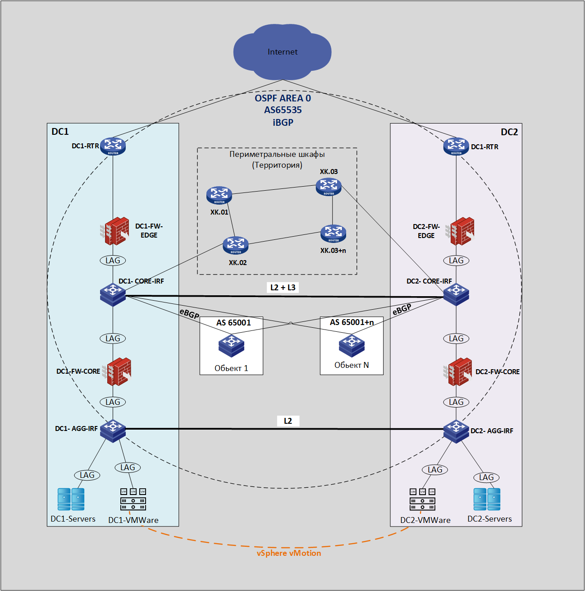

## Разработка и проектирование миграции 3-tier сети ЦОД предприятия на сеть leaf-spine с внедрением архитектуры VXLAN/EVPN

### Цель:
- Споектировать сеть на архитектуре Leaf-spine (Clos)
- Разработать план мигарции существующего ЦОД на архитектуру Leaf-spine c технологией VXLAN/EVPN
- Обеспечить L2 связанность.
- Обспечить L3 связонность для с сетью территории, обьектами предприятия и внутри фабрики.

### Текущая архитектура
ЛВС предприятия располагается в двух ЦОД построеных по архитектуре 3-tier и размещенных в зданиях предприятия - площадка  DC-1 и площадка DC-2. Обе площадки идентичны по составу для обеспечения отказоустойчивости в случае полного или частичного отказа одной из площадок.

В ЦОД распологаются сервера обеспечивающие работоспособность корпаративных сервисов, а так же сервера систем безопасности территории предприятия и инженерных систем. 

На территории предприятия построена сеть безопасности и инженерных систем Собранная кольцами по OSPF. Перриметральные кольца подключаются к обоим ЦОД.

Также на территории размещаются капитальные строения (Обьекты) в которых присутсвует своя внутренняя ЛВС, а для обеспечения связи с ЦОД они подключены по одному каналу связи в каждый ЦОД.

### Схема текущей сети
> схема упрощена



В настоящий момент планируется перенос обоих ЦОД с существующих площадок на другую площадку предприятия и последующего их обьединения.

### Состав оборудования ЦОД
Вся сеть предприятия построена на оборудовании HPE, но так как в EVE-NG существует только один образ для их оборудования "h3cvsr2k" для возможности реализации L2 функций буду использовать образ Arista.

Все коммутаторы ядра и аггрегации и доступа собраны в IRF фабрику. При миграции планируется отказ от стеков, что бы получить удобство в обслуживании и отказоустойчивость на уровне управления.

|коммутатор|модель|текущая роль|планируемая|кол-во|
|----------|------|------------|-----------|------|
|DC1-2-core|HPE FlexFabric 7900|ядро|Spine/Bleaf| 4 |
|DC1-2-AGG|HPE FlexFabric 5900|аггрегация|Leaf/bgw|8|


Разобрав все IRF фабрики (стеки) мы получим достаточное колличество оборудования для построения сети ЦОД по архитектуре Leaf-spine.\
 Всё оборудование поддерживает технологии VXLAN/EVPN

## Схема сети в переходный период.


### План миграции

1. На отдельной площадке собирается и настраивается VXLAN/EVPN фабрика. 
2. Между коммутаторами DC-1-SW-1 и DC-LZ-SW-2 Подключается дополнительный L2 линк для миграции сервисов в новый ЦОД.
3. В DC-1 постепенно будут отключаться SVI интерфейсы сервисов, что бы они начинали работать через DC-LZ.
4. Коммутаторы территории подключаются к Border Leaf по eBGP.
5. Коммутаторы обьектов подключаются к Border Leaf по eBGP. 
6. Сервисы до полной миграции, в разных DC будут маршрутизироваться через Hand-off между DC-1-CORE и Border leaf в новом DC.
7. После полной миграции DC-1 останавливается и дополнительное оборудование подключается в DC-LZ на новой площадке или 

### Именование оборрудования

**DC** - Data center\
**SP** - Spine\
**LF** - Leaf\
**BLF** - Border leaf\
**RTR** - Router\
**SW** - Switch\
**CORE** - Core 

- ### Адресное пространство DC-LZ

#### Loopback адреса

| **Device** | **Loopback1** | **Loopback2** | 
| --- | --- | --- |
| **DC-LZ-SP-1** | 10.0.1.1/32 | 10.0.1.2/32 |
| **DC-LZ-SP-2** | 10.0.2.1/32 | 10.0.2.2/32 | 
| **DC-LZ-LF-1** | 10.1.1.1/32 | 10.1.1.2/32 | 
| **DC-LZ-LF-2** | 10.1.2.1/32 | 10.1.2.2/32 | 
| **DC-LZ-LF-3** | 10.1.3.1/32 | 10.1.3.2/32 | 
| **DC-LZ-LF-4** | 10.1.4.1/32 | 10.1.4.2/32 | 
| **DC-LZ-BLF-1** | 10.3.1.1/32 | 10.3.1.2/32 | 
|**DC-LZ-BLF-2**|10.3.2.1/32| 10.3.2.2/32|
| **DC-LZ-RTR** |10.4.0.1/32| 10.4.0.2/32|

#### Подсети для p2p линков на Spine

| **Device** | **DC-LZ-LF-1** | **DC-LZ-LF-2** |**DC-LZ-LF-3** | **DC-LZ-LF-4**| **DC-LZ-BLF-1** | **DC-LZ-BLF-2**|
| --- | --- | --- | --- |---|---|---|
| **DC-LZ-SP-1** | 10.2.1.0/31 | 10.2.1.2/31 |10.2.1.4/31|10.2.1.6/31|10.2.1.100/31 | 10.2.1.102/31|
| **DC-LZ-SP-2** | 10.2.2.0/31 | 10.2.2.2/31 |10.2.1.4/31|10.2.1.6/31|10.2.2.100/31 | 10.2.2.102/31|

#### Подсети для p2p линков на Border Leaf для внешних соединений 

| **Device** | **VRF**|**DC-LZ-RTR** | **DC-1-CORE** |**LZ-XK-01** | **LZ-OBJ-01**| 
| --- | --- | --- |----| --- |---|
| **DC-LZ-BLF-1** |SRV| 10.4.1.0/31 | 10.4.1.2/31 |10.4.1.4/31|10.4.1.6/31|
|                 |MGMT| 10.4.1.100/31 | |||
| **DC-LZ-BLF-2** |SRV|10.4.2.0/31 | 10.4.2.2/31 |10.4.1.4/31|10.4.1.6/31|
|                 |MGMT| 10.4.2.100/31 | |||

#### адреса p2p на интерфейсах

| **Device** | **Порт** | **название** | **Адрес** | **Маска** |
| --- | --- | --- | --- | --- |
| **DC-LZ-SP-1** | Et1 | DC-LZ-LF-1 | 10.2.1.0 | 255.255.255.254 |
|     | Et2 | DC-LZ-LF-2 | 10.2.1.2 | 255.255.255.254 |
|     | Et3 | DC-LZ-LF-3 | 10.2.1.4 | 255.255.255.254 |
|     | Et4 | DC-LZ-LF-4 | 10.2.1.6 | 255.255.255.254 |
|     | Et5 | DC-LZ-BLF-1 | 10.2.1.100 | 255.255.255.254 |
|     | Et6 | DC-LZ-BLF-2 | 10.2.1.102 | 255.255.255.254 |10.1
| **DC-LZ-SP-2** | Et1 | DCN-LF-1 | 10.2.2.0 | 255.255.255.254 |
|     | Et2 | DC-LZ-LF-2 | 10.2.2.2 | 255.255.255.254 |
|     | Et3 | DC-LZ-LF-3 | 10.2.2.4 | 255.255.255.254 |
|     | Et4 | DC-LZ-LF-4 | 10.2.2.6 | 255.255.255.254 |
|     | Et5 | DC-LZ-BLF-1 | 10.2.2.100 | 255.255.255.254 |
|     | Et6 | DC-LZ-BLF-2 | 10.2.2.102 | 255.255.255.254 |
| **DC-LZ-LF-1** | Et1 | DC-L-SP.1 | 10.2.1.1 | 255.255.255.254 |
|     | Et2 | DC-LZ-SP-2 | 10.2.2.1 | 255.255.255.254 |
| **DC-LZ-LF-2** | Et1 | DC-L-SP-1 | 10.2.1.3 | 255.255.255.254 |
|     | Et2 | DC-LZ-SP-2 | 10.2.2.3 | 255.255.255.254 |
| **DC-LZ-LF-3** | Et1 | DC-L-SP-1 | 10.2.1.5 | 255.255.255.254 |
|     | Et2 | DC-LZ-SP-2 | 10.2.2.5 | 255.255.255.254 |
| **DC-LZ-LF-4** | Et1 | DC-L-SP-1 | 10.2.1.7 | 255.255.255.254 |
|     | Et2 | DC-LZ-SP-2 | 10.2.2.7 | 255.255.255.254 |
| **DC-LZ-BLF-1** | Et1 | DC-L-SP-1 | 10.2.1.5 | 255.255.255.254 |
|     | Et2 | DC-LZ-SP-2 | 10.2.2.5 | 255.255.255.254 |
|     | Et4.500 | DC-LZ-RTR_VRF_SRV | 10.4.1.0 | 255.255.255.254 |
|     | Et4.600 | DC-LZ-RTR_VRF_MGMT | 10.4.1.100 | 255.255.255.254 |
|     | Et5 | DC-1-CORE_VRF_SRV | 10.4.1.2 | 255.255.255.254 |
|     | Et6 | LZ-XK-01 | 10.4.1.4 | 255.255.255.254 |
|     | Et7 | LZ-OBJ-01 | 10.4.1.6 | 255.255.255.254 |
| **DC-LZ-BLF-2**| Et1 | DC-L-SP-1 | 10.2.1.7 | 255.255.255.254 |
|     | Et2 | DC-LZ-SP-2 | 10.2.2.7 | 255.255.255.254 |
|     | Et4.500 | DC-LZ-RTR_VRF_SRV | 10.4.2.0 | 255.255.255.254 |
|     | Et4.600 | DC-LZ-RTR_VRF_MGMT | 10.4.2.100 | 255.255.255.254 |
|     | Et5 | DC-1-CORE_VRF_SRV | 10.4.2.2 | 255.255.255.254 |
|     | Et6 | LZ-XK-01 | 10.4.2.4 | 255.255.255.254 |
|     | Et7 | LZ-OBJ-01 | 10.4.2.6 | 255.255.255.254 |
| **DC-LZ-RTR** | Gi1/0.500 | DC-LZ-BLF-1_VRF_SRV | 10.4.1.1 | 255.255.255.254 |
|     | Gi1/0.600 | DC-LZ-BLF-2_VRF_SRV | 10.4.2.101 | 255.255.255.254 |
|     | Gi2/0.500 | DC-LZ-BLF-2_VRF_SRV | 10.4.2.1 | 255.255.255.254 |
|     | Gi2/0.600 | DC-LZ-BLF-2_VRF_MGMT | 10.4.2.101 | 255.255.255.254 |
| **DC-1-CORE** | Et4 | DC-LZ-BLF-1_VRF_SRV | 10.4.1.3 | 255.255.255.254 |
|     | Et5 | DC-LZ-BLF-2_VRF_SRV | 10.4.2.3 | 255.255.255.254 |
| **LZ-XK-01** | Et2 | DC-LZ-BLF-1 | 10.4.1.5 | 255.255.255.254 |
|     | Et3 | DC-LZ-BLF-2 | 10.4.2.5 | 255.255.255.254 |
| **LZ-OBJ-1** | Et2 | DC-LZ-BLF-1 | 10.4.1.7 | 255.255.255.254 |
|     | Et3 | DC-LZ-BLF-2 | 10.4.2.7 | 255.255.255.254 |

 - ### Адресный план DC-1

#### Loopback адреса

| **Device** | **Loopback0** |
| --- | --- | 
| **DC-1-CORE** |10.192.127.1|
| **LZ-XK-01**  | 10.192.127.11|
| **LZ-OBJ-01** | 10.192.127.21|

#### Loopback адреса иметирующие системы

| **Обьект** |**Система** | **Loopback1** |
| --- | --- | ----| 
| **LZ-XK-01**  | SVN-1 |10.194.1.10|
| **LZ-OBJ-01** | SVN-2 |10.194.2.10|

#### Подсети для p2p 

| **Device** | **LZ-XK-01**| **LZ-OBJ-1** |
| --- | --- | --- | 
| **DC-1-CORE** | 10.192.2.0/31 | 10.192.2.2/31|

| **Device** | **Порт** | **название** | **Адрес** | **Маска** |
| --- | --- | --- | --- | --- |
| **DC-1-CORE** | G2/0 | LZ-XK-01 | 10.192.2.0 | 255.255.255.254 |
|     | G3/0 | LZ-OBJ-1 | 10.192.2.2 | 255.255.255.254 |
| **LZ-XK-01** | Gi1/0 | DC-1-CORE | 10.192.2.1 | 255.255.255.254 |
| **LZ-OBJ-1** | Gi1/0 | DC-1-CORE | 10.192.2.3 | 255.255.255.254 |

- ### Адресное пространство сервисов 

|Название|Vlan| Network| VRF |
|----|----|----|----|
|SRV10|vlan 10|10.182.10.0/24| SRV|
|SRV20|vlan 20|10.182.20.0/24| SRV|
|SRV30|vlan 20|10.182.20.0/24| SRV|
|MGMT| vlan 2001|10.200.1.0/24| MGMT|


### Номера автономных систем.

|Площадка|AS|
|----|----|
|DC-LZ| 64600|
|DC-1| 65535|
|LZ-OBJ-1| 65001|
|DC-LZ-RTR|64700| 

### распределение vni

| vni | назначение| VLAN|VRF |
|-----|-----------|-----|-----|
|10| L2VNI |vlan 10 | SRV
|20| L2VNI| vlan 20 | SRV
|30| L2VNI| vlan 30 | SRV
|2001| L2VNI|vlan 2001| MGMT
|5000| L3VNI| | SRV |
|6000| L3VNI| | MGMT|

## Конфигурации оборудования

### DC-1

 - [DC-1-CORE](Configs/DC-1-CORE.txt)

 - [DC-LZ-SW-1](Configs/DC-LZ-SW-1.txt)

### Обьект 1

 - [LZ-Obj-1](Configs/LZ-OBJ-1.txt)

### Периметральные шкафы (Территория)

 - [LZ-XK-01](Configs/LZ-XK-01.txt)

### DC-LZ

- [DC-LZ-SP-1](Configs/DC-LZ-SP-1.txt)

- [DC-LZ-SP-2](Configs/DC-LZ-SP-2.txt)

- [DC-LZ-BLF-1](Configs/DC-LZ-BLF-1.txt)

- [DC-LZ-BLF-2](Configs/DC-LZ-BLF-2.txt)

- [DC-LZ-LF-1](Configs/DC-LZ-LF-1.txt)

- [DC-LZ-LF-2](Configs/DC-LZ-LF-2.txt)

- [DC-LZ-LF-3](Configs/DC-LZ-LF-3.txt)

- [DC-LZ-LF-4](Configs/DC-LZ-LF-4.txt)

- [DC-LZ-SW-2](Configs/DC-LZ-SW-2.txt)

- [DC-LZ-SW-3](Configs/DC-LZ-SW-3.txt)

- [DC-LZ-RTR](Configs/DC-LZ-RTR.txt)

### Что настроили.

Настроили VXLAN/EVPN фабрику и смоделировали подключения к старому ЦОД, периметральным шкафам и обьектам предприятия.

- Underlay настроен на OSPF, так как на предприятии он широко используется и знаком.
- Overlay настроен на iBGP.
- В фабрике настроено два VRF: SRV и MGMT для моделирования двух сегментов. Сегмент продуктивный - SRV и сегмент управления MGMT.
- Внутри каждого VRF настроен функционал VXLAN L2VNI и L3VNI.
- Для сохранения MAC адреса шлюза виртуальных машин при миграции, настроена технология Anycast gateway. 
- Для подключения серверов, используются пары Leaf обьеденённых по технологии ESI LAG (EVPN MH).
- Для обеспечения связи двух сегментов настроен Hand-off через маршрутизатор DC-LZ-RTR. В реальной сети VRF Hand-off между сегментами будет осуществляться на Фаерволе.
- Все DCI(внешние) подключения удалённых обьектов предприятия к фабрике осуществлены через пару Border leaf.
- DC-1 также подключён к фабрике через Border Leaf и настроен BGP AF ipv4 в VRF SRV, что бы во время миграции сервисы и системы которые ещё находятся в старом ЦОД могли маршрутизироваться до серверов котороые уже находятся в новом ЦОД.
- Для проверки L3 связанности в Hand-off на кажом обьекте насторен Loopback 1 интерфейс, которой моделирует подсеть системы.
- Выход во внешние сети огранизован также через маршрутизатор DC-LZ-RTR. На DC-LZ-RTR в eBGP для каждого VRF анонсируем маршрут по умолчанию. `peer BLEAF_VRF_SRV default-route-advertise` и `peer BLEAF_VRF_MGMT default-route-advertise`. Для Имитирования **Интернета** на маршрутизаторе настроен loopback 1 с адресом 77.88.8.8.
- Так BGP не принеммает маршруты где в AS_PATH присутвует его же AS. На маршрутизаторе настроен `substitute-as` который подменяет приходящую AS на свою. Что бы можно было отдать маршруты обратно в Фабрику. 
- На маршрутизаторе настроена Route-map фильтрующая на out маршруты своего же VRF. Что бы в VRF SRV отдавать маршруты VRF MGMT, а в VRF MGMT отдавать маршруты VRF SRV.
- На Border leaf в сторону всех внешних сетей в AF ipv4 настроена Route-map фильтрующая все /32 префиксы которые прилетают от route typ 2 mac-ip.
- Для возможности "перетаскивания" vlan со старого ЦОД в новый огрнизован дополнительный L2 линк между обычными коммутаторами. 

### Проверки.

- #### L2 связанность вутри VRF.

<details>
<summary>Проверим L2 доступность внутри VFR SRV SRV10-2 до SRV20-20</summary>

```
root@SRV10-2:~# ping 10.182.10.30
PING 10.182.10.30 (10.182.10.30) 56(84) bytes of data.
64 bytes from 10.182.10.30: icmp_seq=1 ttl=64 time=210 ms
64 bytes from 10.182.10.30: icmp_seq=2 ttl=64 time=110 ms
64 bytes from 10.182.10.30: icmp_seq=3 ttl=64 time=80.8 ms
64 bytes from 10.182.10.30: icmp_seq=4 ttl=64 time=90.7 ms
^C
--- 10.182.10.30 ping statistics ---
4 packets transmitted, 4 received, 0% packet loss, time 3004ms
rtt min/avg/max/mdev = 80.815/122.838/209.546/51.172 ms
root@SRV10-2:~# 
```
</details>

<details>
<summary>Проверим L2 доступность внутри VRF MGMT MGMT-1 до MGMT-2</summary>

```
root@MGMT-1:~# ping 10.200.1.20
PING 10.200.1.20 (10.200.1.20) 56(84) bytes of data.
64 bytes from 10.200.1.20: icmp_seq=1 ttl=64 time=228 ms
64 bytes from 10.200.1.20: icmp_seq=2 ttl=64 time=97.8 ms
64 bytes from 10.200.1.20: icmp_seq=3 ttl=64 time=80.3 ms
64 bytes from 10.200.1.20: icmp_seq=4 ttl=64 time=76.7 ms
64 bytes from 10.200.1.20: icmp_seq=5 ttl=64 time=104 ms
^C
--- 10.200.1.20 ping statistics ---
5 packets transmitted, 5 received, 0% packet loss, time 4006ms
rtt min/avg/max/mdev = 76.650/117.292/228.050/56.308 ms
```
</details>

- #### L3 связанность внутри VRF.

<details>
<summary>Проверим L3 доступность внутри VRF SRV SRV20-2 до SRV10-3</summary>

```
root@SRV20-2:~# ping 10.182.10.30
PING 10.182.10.30 (10.182.10.30) 56(84) bytes of data.
64 bytes from 10.182.10.30: icmp_seq=1 ttl=62 time=116 ms
64 bytes from 10.182.10.30: icmp_seq=2 ttl=62 time=69.0 ms
64 bytes from 10.182.10.30: icmp_seq=3 ttl=62 time=73.5 ms
64 bytes from 10.182.10.30: icmp_seq=4 ttl=62 time=71.9 ms
64 bytes from 10.182.10.30: icmp_seq=5 ttl=62 time=69.2 ms
^C
--- 10.182.10.30 ping statistics ---
5 packets transmitted, 5 received, 0% packet loss, time 4006ms
rtt min/avg/max/mdev = 69.026/79.887/115.835/18.051 ms
```
</details>

- #### Hand-off между VRF.

<details>
<summary>Проверим Hand-off между SRV10-2 и MGMT-2</summary>

```
root@SRV10-2:~# ping 10.200.1.20
PING 10.200.1.20 (10.200.1.20) 56(84) bytes of data.
64 bytes from 10.200.1.20: icmp_seq=1 ttl=59 time=238 ms
64 bytes from 10.200.1.20: icmp_seq=2 ttl=59 time=177 ms
64 bytes from 10.200.1.20: icmp_seq=3 ttl=59 time=157 ms
64 bytes from 10.200.1.20: icmp_seq=4 ttl=59 time=141 ms
64 bytes from 10.200.1.20: icmp_seq=5 ttl=59 time=180 ms
^C
--- 10.200.1.20 ping statistics ---
5 packets transmitted, 5 received, 0% packet loss, time 4006ms
rtt min/avg/max/mdev = 140.891/178.752/238.477/33.067 ms
```
```
root@SRV10-2:~# tracepath -n 10.200.1.20
 1?: [LOCALHOST]                      pmtu 1500
 1:  10.182.10.1                                         147.902ms 
 1:  10.182.10.1                                          54.057ms 
 2:  10.4.1.4                                             74.509ms 
 3:  no reply
 4:  10.4.1.100                                           89.710ms 
 5:  10.200.1.1                                          111.819ms 
 6:  10.200.1.20                                         235.651ms reached
     Resume: pmtu 1500 hops 6 back 6 
```
</details>

- #### Hand-off между внешними сетями.

<details>
<summary>Проверим доступность LZ-XK-01 c SRV10-2 </summary>

```
rroot@SRV10-2:~# ping 10.194.1.10
PING 10.194.1.10 (10.194.1.10) 56(84) bytes of data.
64 bytes from 10.194.1.10: icmp_seq=1 ttl=62 time=152 ms
64 bytes from 10.194.1.10: icmp_seq=2 ttl=62 time=106 ms
64 bytes from 10.194.1.10: icmp_seq=3 ttl=62 time=85.2 ms
64 bytes from 10.194.1.10: icmp_seq=4 ttl=62 time=89.1 ms
64 bytes from 10.194.1.10: icmp_seq=5 ttl=62 time=86.5 ms
^C
--- 10.194.1.10 ping statistics ---
5 packets transmitted, 5 received, 0% packet loss, time 4006ms
rtt min/avg/max/mdev = 85.189/103.725/151.709/25.152 ms
```
</details>

<details>
<summary>Проверим доступность LZ-OBJ-1 c SRV10-2 </summary>

```
root@SRV10-2:~# ping -D -O 10.194.2.10
PING 10.194.2.10 (10.194.2.10) 56(84) bytes of data.
[1739295148.734693] 64 bytes from 10.194.2.10: icmp_seq=1 ttl=62 time=153 ms
[1739295149.678632] 64 bytes from 10.194.2.10: icmp_seq=2 ttl=62 time=95.7 ms
[1739295150.699240] 64 bytes from 10.194.2.10: icmp_seq=3 ttl=62 time=114 ms
[1739295151.675776] 64 bytes from 10.194.2.10: icmp_seq=4 ttl=62 time=89.2 ms
[1739295152.670762] 64 bytes from 10.194.2.10: icmp_seq=5 ttl=62 time=82.7 ms
[1739295153.678987] 64 bytes from 10.194.2.10: icmp_seq=6 ttl=62 time=88.9 ms
[1739295154.682630] 64 bytes from 10.194.2.10: icmp_seq=7 ttl=62 time=91.3 ms
[1739295155.677270] 64 bytes from 10.194.2.10: icmp_seq=8 ttl=62 time=84.4 ms
^C
--- 10.194.2.10 ping statistics ---
8 packets transmitted, 8 received, 0% packet loss, time 7011ms
rtt min/avg/max/mdev = 82.658/99.932/152.969/22.043 ms
```
</details>

<details>
<summary>Проверим доступность DC-1-CORE c SRV10-2 </summary>

```
root@SRV10-2:~# ping -D -O 10.193.1.10
PING 10.193.1.10 (10.193.1.10) 56(84) bytes of data.
[1739295228.094378] 64 bytes from 10.193.1.10: icmp_seq=1 ttl=62 time=73.4 ms
[1739295229.122845] 64 bytes from 10.193.1.10: icmp_seq=2 ttl=62 time=100 ms
[1739295230.100254] 64 bytes from 10.193.1.10: icmp_seq=3 ttl=62 time=75.9 ms
[1739295231.110210] 64 bytes from 10.193.1.10: icmp_seq=4 ttl=62 time=84.6 ms
[1739295232.099556] 64 bytes from 10.193.1.10: icmp_seq=5 ttl=62 time=72.1 ms
[1739295233.103714] 64 bytes from 10.193.1.10: icmp_seq=6 ttl=62 time=75.1 ms
[1739295234.112114] 64 bytes from 10.193.1.10: icmp_seq=7 ttl=62 time=82.4 ms
^C
--- 10.193.1.10 ping statistics ---
7 packets transmitted, 7 received, 0% packet loss, time 6009ms
rtt min/avg/max/mdev = 72.109/80.523/100.167/9.091 ms
```
</details>

<details>
<summary>Проверим доступность SRV10 и SRV20 c SRV30 со старой площадки через Border Leaf </summary>

```
root@SRV30-1:~# ping 10.182.10.20
PING 10.182.10.20 (10.182.10.20) 56(84) bytes of data.
64 bytes from 10.182.10.20: icmp_seq=1 ttl=61 time=132 ms
64 bytes from 10.182.10.20: icmp_seq=2 ttl=61 time=95.0 ms
64 bytes from 10.182.10.20: icmp_seq=3 ttl=61 time=110 ms
64 bytes from 10.182.10.20: icmp_seq=4 ttl=61 time=107 ms
^C
--- 10.182.10.20 ping statistics ---
4 packets transmitted, 4 received, 0% packet loss, time 3004ms
rtt min/avg/max/mdev = 95.041/110.979/131.680/13.234 ms
```
```
root@SRV30-1:~# tracepath -n 10.182.10.20
 1?: [LOCALHOST]                      pmtu 1500
 1:  10.182.30.1                                          21.336ms 
 1:  10.182.30.1                                          16.669ms 
 2:  10.4.1.2                                             25.466ms 
 3:  10.182.20.1                                          48.345ms 
 4:  10.182.10.20                                        129.515ms reached
     Resume: pmtu 1500 hops 4 back 4 
```
```
PING 10.182.20.20 (10.182.20.20) 56(84) bytes of data.
64 bytes from 10.182.20.20: icmp_seq=1 ttl=61 time=64.8 ms
64 bytes from 10.182.20.20: icmp_seq=2 ttl=61 time=60.8 ms
64 bytes from 10.182.20.20: icmp_seq=3 ttl=61 time=81.6 ms
64 bytes from 10.182.20.20: icmp_seq=4 ttl=61 time=66.8 ms
^C
--- 10.182.20.20 ping statistics ---
4 packets transmitted, 4 received, 0% packet loss, time 3004ms
rtt min/avg/max/mdev = 60.818/68.512/81.609/7.860 ms
```
```
root@SRV30-1:~# tracepath -n 10.182.20.20
 1?: [LOCALHOST]                      pmtu 1500
 1:  10.182.30.1                                          18.698ms 
 1:  10.182.30.1                                          14.523ms 
 2:  10.4.1.2                                             24.186ms 
 3:  10.182.20.1                                          42.453ms 
 4:  10.182.20.20                                         61.538ms reached
     Resume: pmtu 1500 hops 4 back 4 
```
</details>

<details>
<summary>Сымитируем переключение SRV30 в новый шлюз. Во время проверки будем пинговать SRV20-2. В момент выключения SVI на DC-1-CORE и включении SVI на DC-LZ-LF-1 потерялось 4и пакета.  </summary>

```
[1739295864.135575] 64 bytes from 10.182.20.20: icmp_seq=43 ttl=61 time=58.0 ms
[1739295865.142558] 64 bytes from 10.182.20.20: icmp_seq=44 ttl=61 time=63.4 ms
[1739295867.099659] no answer yet for icmp_seq=45
[1739295868.123648] no answer yet for icmp_seq=46
[1739295869.147635] no answer yet for icmp_seq=47
[1739295870.171661] no answer yet for icmp_seq=48
[1739295870.345900] 64 bytes from 10.182.20.20: icmp_seq=49 ttl=63 time=173 ms
[1739295871.230651] 64 bytes from 10.182.20.20: icmp_seq=50 ttl=63 time=57.6 ms
[1739295872.233785] 64 bytes from 10.182.20.20: icmp_seq=51 ttl=63 time=59.5 ms

```
```
root@SRV30-1:~# tracepath -n 10.182.20.20
 1?: [LOCALHOST]                      pmtu 1500
 1:  10.182.30.1                                          40.348ms 
 1:  10.182.30.1                                          30.919ms 
 2:  10.182.20.20                                         51.427ms reached
     Resume: pmtu 1500 hops 2 back 2 
```
</details>

<summary>Проверим выборочно доступность Internet </summary>

```
root@SRV30-1:~# ping 77.88.8.8
PING 77.88.8.8 (77.88.8.8) 56(84) bytes of data.
64 bytes from 77.88.8.8: icmp_seq=1 ttl=253 time=36.2 ms
64 bytes from 77.88.8.8: icmp_seq=2 ttl=253 time=28.4 ms
64 bytes from 77.88.8.8: icmp_seq=3 ttl=253 time=36.0 ms
^C
--- 77.88.8.8 ping statistics ---
3 packets transmitted, 3 received, 0% packet loss, time 2003ms
rtt min/avg/max/mdev = 28.350/33.505/36.208/3.646 ms
```
```
root@SRV10-2:~# ping 77.88.8.8
PING 77.88.8.8 (77.88.8.8) 56(84) bytes of data.
64 bytes from 77.88.8.8: icmp_seq=1 ttl=253 time=139 ms
64 bytes from 77.88.8.8: icmp_seq=2 ttl=253 time=103 ms
64 bytes from 77.88.8.8: icmp_seq=3 ttl=253 time=77.1 ms
64 bytes from 77.88.8.8: icmp_seq=4 ttl=253 time=79.1 ms
64 bytes from 77.88.8.8: icmp_seq=5 ttl=253 time=83.9 ms
64 bytes from 77.88.8.8: icmp_seq=6 ttl=253 time=74.3 ms
64 bytes from 77.88.8.8: icmp_seq=7 ttl=253 time=76.3 ms
64 bytes from 77.88.8.8: icmp_seq=8 ttl=253 time=80.6 ms
^C
--- 77.88.8.8 ping statistics ---
8 packets transmitted, 8 received, 0% packet loss, time 7011ms
rtt min/avg/max/mdev = 74.270/89.178/139.247/20.708 ms
```
```
root@MGMT-1:~# ping 77.88.8.8
PING 77.88.8.8 (77.88.8.8) 56(84) bytes of data.
64 bytes from 77.88.8.8: icmp_seq=1 ttl=253 time=59.9 ms
64 bytes from 77.88.8.8: icmp_seq=2 ttl=253 time=50.8 ms
64 bytes from 77.88.8.8: icmp_seq=3 ttl=253 time=53.5 ms
64 bytes from 77.88.8.8: icmp_seq=4 ttl=253 time=36.3 ms
64 bytes from 77.88.8.8: icmp_seq=5 ttl=253 time=48.1 ms
^C
--- 77.88.8.8 ping statistics ---
5 packets transmitted, 5 received, 0% packet loss, time 4006ms
rtt min/avg/max/mdev = 36.329/49.721/59.928/7.762 ms
```
</details>

### Выводы: 
Получилось настроить VXLAN/EVPN фабрику и смоделировать переходный период с одного ЦОД на архитектуре 3-Tier на новый ЦОД с архитектурой VXLAN/EVPN сохранив связанность со всеми площадками.

Получилось сымитировать переключение сервиса со старой площадки на новую с небольшим downtime и минимальными технологическими решениями. Нужен всего лишь L2 линк между коммутаторами.

Так же удалось получить прекрасный стенд для дальнейших исследований.