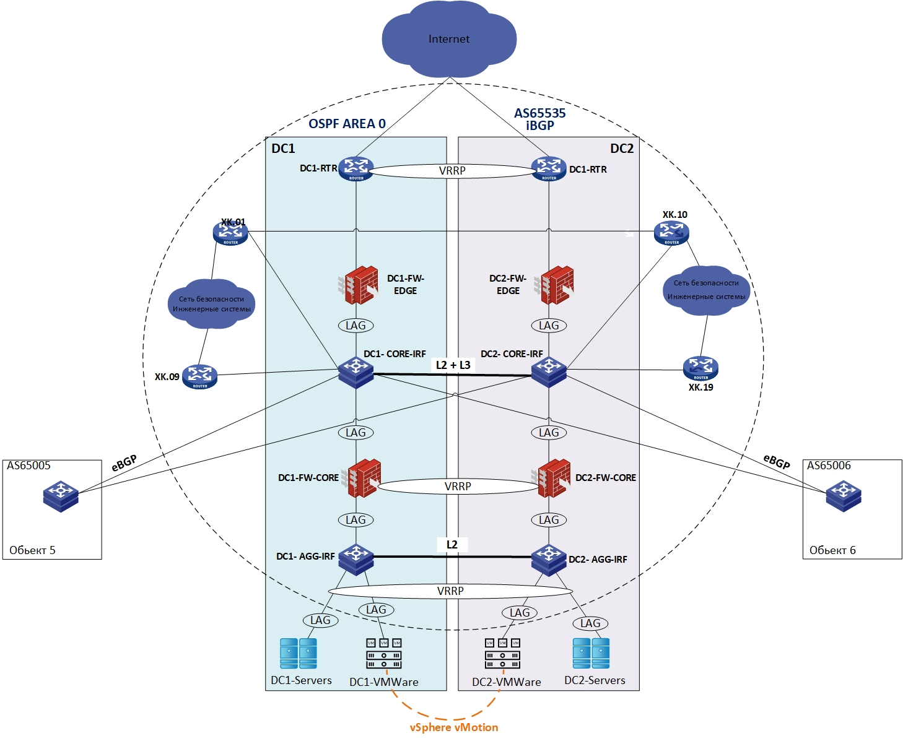

## Разработка и проектирование миграции 3-tier сети ЦОД предприятия на сеть leaf-spine с внедрением архитектуры VXLAN/EVPN

### Цель:
- Споектировать сеть Leaf-spine (Clos)
- Разработать план мигарции существующего ЦОД на архитектуру Leaf-spine c технологией VXLAN/EVPN
- Обеспечить L2 связанность.
- Обспечить L3 связонность для с сетью территории, обьектами предприятия и внутри фабрики.

### Текущая архитектура
ЛВС предприятия располагается в двух ЦОД построеных по архитектуре 3-tier и размещенных в зданиях предприятия - площадка  DC1 и площадка DC2.\
Обе площадки идентичны по составу для обеспечения отказоустойчивости в случае полного или частичного отказа одной из площадок.

В ЦОД распологаются сервера обеспечивающие работоспособность корпаративных сервисов, а так же сервера систем безопасности территории предприятия и инженерных систем. 

На территории предприятия построена кольцевая сеть безопасности и инженерных систем. Сеть подключена с двух сторон в каждый ЦОД.

Также на территории размещаются капитальные строения в которых присутсвует своя внутренняя ЛВС, а для обеспечения связи с ЦОД они подключены по одному каналу связи в каждый ЦОД и настроен eBGP.
### Схема текущей сети
> схема упрощена

В настоящий момент планируется перенос обоих ЦОД с существующих площадок на другую площадку предприятия и последующего их обьединения.

### Состав оборудования ЦОД
Вся сеть предприятия построена на оборудовании HPE, но так как в EVE-NG существует только один образ для их оборудования "h3cvsr2k" для возможности реализации L2 функций буду использовать образ Arista.

Все коммутаторы ядра и аггрегации и доступа собраны в IRF фабрику. При миграции планируется отказ от стеков, что бы получить удобство в обслуживании и отказоустойчивость на уровне управления.

|коммутатор|модель|текущая роль|планируемая|кол-во|
|----------|------|------------|-----------|------|
|DC1-2-core|HPE FlexFabric 7900|ядро|Spine| 4 |
|DC1-2-AGG|HPE FlexFabric 5900|аггрегация|Leaf|4|
|на схеме не указан| HPE FlexFabric 5900| доступ|bleaf/bgw|4|

Разобрав все IRF фабрики (стеки) мы получим достаточное колличество оборудования для построения сети ЦОД по архитектуре Leaf-spine.\
 Всё оборудование поддерживает технологии VXLAN/EVP

### План миграции

1. Между коммутаторами DC-1 и DC-LZ будет подлкючен дополнительный L2 линк.\
2. В DC1 будут отключаться SVI интерфейсы сервисов, что бы они начинали работать через DC-LZ и посредством VXLAN\EVPN их можно было мигрировать между серверверов по L2.
3. Коммутаторы территории подключаются к Border Leaf по eBGP.
4. Коммутаторы обьектов подключаются к Border Leaf по eBGP. 

### Именование оборрудования
|роль площадки|название площадки|роль оборудования|номер|
|----|---|---|---|
|DC|LZ|SP|1|

**DC** - Data center\
**SP** - Spine\
**LF** - Leaf\
**BLF** - Border leaf\
**RTR** - Router\
**AGG** - Aggregation\
**CR** - Core 

### Адресное пространство DC-LZ

#### Loopback адреса

| **Device** | **Loopback1** | **Loopback2** | 
| --- | --- | --- |
| **DC-LZ-SP-1** | 10.0.1.1/32 | 10.0.1.2/32 |
| **DC-LZ-SP-2** | 10.0.2.1/32 | 10.0.2.2/32 | 
| **DC-LZ-LF-1** | 10.1.1.1/32 | 10.1.1.2/32 | 
| **DC-LZ-LF-2** | 10.1.2.1/32 | 10.1.2.2/32 | 
| **DC-LZ-LF-3** | 10.1.3.1/32 | 10.1.3.2/32 | 
| **DC-LZ-LF-4** | 10.1.4.1/32 | 10.1.4.2/32 | 
| **DC-LZ-BLF-1** | 10.3.1.1/32 | 10.3.1.2/32 | 
|**DC-LZ-BLF-2**|10.3.2.1/32| 10.3.2.2/32|
| **DC-LZ-RTR** |10.4.0.1/32| 10.4.0.2/32|

#### Подсети для p2p линков на Spine

| **Device** | **DC-LZ-LF-1** | **DC-LZ-LF-2** |**DC-LZ-LF-3** | **DC-LZ-LF-4**| **DC-LZ-BLF-1** | **DC-LZ-BLF-2**|
| --- | --- | --- | --- |---|---|---|
| **DC-LZ-SP-1** | 10.2.1.0/31 | 10.2.1.2/31 |10.2.1.4/31|10.2.1.6/31|10.2.1.100/31 | 10.2.1.102/31|
| **DC-LZ-SP-2** | 10.2.2.0/31 | 10.2.2.2/31 |10.2.1.4/31|10.2.1.6/31|10.2.2.100/31 | 10.2.2.102/31|

#### Подсети для p2p линков на Border Leaf для внешних соединений

| **Device** | **DC-LZ-RTR** | **DC-1-CORE** |**LZ-XK-01** | **LZ-OBJ-01**| 
| --- | --- | --- | --- |---|
| **DC-LZ-BLF-1** | 10.4.1.0/31 | 10.4.1.2/31 |10.4.1.4/31|10.4.1.6/31|
| **DC-LZ-BLF-2** | 10.4.2.0/31 | 10.4.2.2/31 |10.4.1.4/31|10.4.1.6/31|

#### адреса p2p на интерфейсах

| **Device** | **Порт** | **название** | **Адрес** | **Маска** |
| --- | --- | --- | --- | --- |
| **DC-LZ-SP-1** | Et1 | DC-LZ-LF-1 | 10.2.1.0 | 255.255.255.254 |
|     | Et2 | DC-LZ-LF-2 | 10.2.1.2 | 255.255.255.254 |
|     | Et3 | DC-LZ-LF-3 | 10.2.1.4 | 255.255.255.254 |
|     | Et4 | DC-LZ-LF-4 | 10.2.1.6 | 255.255.255.254 |
|     | Et5 | DC-LZ-BLF-1 | 10.2.1.100 | 255.255.255.254 |
|     | Et6 | DC-LZ-BLF-2 | 10.2.1.102 | 255.255.255.254 |10.1
| **DC-LZ-SP-2** | Et1 | DCN-LF-1 | 10.2.2.0 | 255.255.255.254 |
|     | Et2 | DC-LZ-LF-2 | 10.2.2.2 | 255.255.255.254 |
|     | Et3 | DC-LZ-LF-3 | 10.2.2.4 | 255.255.255.254 |
|     | Et4 | DC-LZ-LF-4 | 10.2.2.6 | 255.255.255.254 |
|     | Et5 | DC-LZ-BLF-1 | 10.2.2.100 | 255.255.255.254 |
|     | Et6 | DC-LZ-BLF-2 | 10.2.2.102 | 255.255.255.254 |
| **DC-LZ-LF-1** | Et1 | DC-L-SP.1 | 10.2.1.1 | 255.255.255.254 |
|     | Et2 | DC-LZ-SP.2 | 10.2.2.1 | 255.255.255.254 |
| **DC-LZ-LF-2** | Et1 | DC-L-SP-1 | 10.2.1.3 | 255.255.255.254 |
|     | Et2 | DC-LZ-SP.2 | 10.2.2.3 | 255.255.255.254 |
| **DC-LZ-LF-3** | Et1 | DC-L-SP-1 | 10.2.1.5 | 255.255.255.254 |
|     | Et2 | DC-LZ-SP.2 | 10.2.2.5 | 255.255.255.254 |
| **DC-LZ-LF-4** | Et1 | DC-L-SP-1 | 10.2.1.7 | 255.255.255.254 |
|     | Et2 | DC-LZ-SP.2 | 10.2.2.7 | 255.255.255.254 |
| **DC-LZ-BLF-1** | Et1 | DC-L-SP-1 | 10.2.1.5 | 255.255.255.254 |
|     | Et2 | DC-LZ-SP.2 | 10.2.2.5 | 255.255.255.254 |
|     | Et4 | DC-LZ-RTR | 10.4.1.0 | 255.255.255.254 |
|     | Et5 | DC-1-CORE | 10.4.1.2 | 255.255.255.254 |
|     | Et6 | LZ-XK-01 | 10.4.1.4 | 255.255.255.254 |
|     | Et7 | LZ-OBJ-01 | 10.4.1.6 | 255.255.255.254 |
| **DC-LZ-BLF-2**| Et1 | DC-L-SP-1 | 10.2.1.7 | 255.255.255.254 |
|     | Et2 | DC-LZ-SP-2 | 10.2.2.7 | 255.255.255.254 |
|     | Et4 | DC-LZ-RTR | 10.4.2.0 | 255.255.255.254 |
|     | Et5 | DC-1-CORE | 10.4.2.2 | 255.255.255.254 |
|     | Et6 | LZ-XK-01 | 10.4.2.4 | 255.255.255.254 |
|     | Et7 | LZ-OBJ-01 | 10.4.1.6 | 255.255.255.254 |
| **DC-LZ-RTR** | Et1 | DC-L-SP-1 | 10.2.1.5 | 255.255.255.254 |
|     | Et2 | DC-LZ-SP.2 | 10.2.2.5 | 255.255.255.254 |
| **DC-1-CORE** | Et1 | DC-L-SP-1 | 10.2.1.5 | 255.255.255.254 |
|     | Et2 | DC-LZ-SP.2 | 10.2.2.5 | 255.255.255.254 |
| **LZ-XK-01** | Et1 | DC-L-SP-1 | 10.2.1.5 | 255.255.255.254 |
|     | Et2 | DC-LZ-SP.2 | 10.2.2.5 | 255.255.255.254 |
| **LZ-OBJ-1** | Et1 | DC-L-SP-1 | 10.2.1.5 | 255.255.255.254 |
|     | Et2 | DC-LZ-SP.2 | 10.2.2.5 | 255.255.255.254 |

### Адресный план DC-1

#### Loopback адреса

| **Device** | **Loopback0** |
| --- | --- | 
| **DC-1-CORE** |10.192.127.1|
| **LZ-XK-01**  | 10.192.127.11|
| **LZ-OBJ-01** | 10.192.127.21|

### Адресное пространство сервисов 

|Название|Vlan| Network| VRF |
|----|----|----|----|
|SRV10|vlan 10|10.182.10.0/24| SRV|
|SRV20|vlan 20|10.182.20.0/24| SRV|
|MGMT| vlan 2001|10.200.1.0/24| MGMT|

### Адреса клиентов

На

### Номера автономных систем.

|Площадка|AS|
|----|----|
|DC-LZ| 646000|
|DC-1| 65535|
|obj1| 65001|

### распределение vni

| vni | назначение| VLAN/VRF |
|-----|-----------|----------|
|10| L2VNI |vlan 10 |
|20| L2VNI| vlan 20 |
|2001| L2VNI|vlan 2001|
|5000| L3VNI| SRV |
|6000| L3VNI| MGMT|